
<table class="sphinxhide" width="100%">
 <tr width="100%">
    <td align="center"><h1>AI Engine Development</h1>
    <a href="https://www.xilinx.com/products/design-tools/vitis.html">See Vitis™ Development Environment on xilinx.com</br></a>
    <a href="https://www.xilinx.com/products/design-tools/vitis/vitis-ai.html">See Vitis™ AI Development Environment on xilinx.com</a>
    </td>
 </tr>
</table>

# Polyphase Channelizer on AIE-ML using Vitis Libraries

***Version: Vitis 2024.2***

## Table of Contents

- [Polyphase Channelizer on AIE-ML using Vitis Libraries](#polyphase-channelizer-on-AIE-ML-using-Vitis-Libraries)
  - [Table of Contents](#table-of-contents)
  - [Introduction](#introduction)
  - [Channelizer Requirements](#channelizer-requirements)
  - [System Partitioning](#system-partitioning)
    - [Filterbank System Partitioning](#filterbank-system-partitioning)
    - [IFFT-2D System Partitioning](#ifft-2d-system-Partitioning)
  - [Design Resources](#design-resources)
  - [Build and Run Design](#build-and-run-design)
    - [Setup \& Initialization](#setup--initialization)
    - [Hardware Emulation](#hardware-emulation)
    - [Hardware](#hardware)
  - [References](#references)
  - [Support](#support)
  - [License](#license)

## Introduction

AMD Vitis™ Libraries introduced two new IP elements to simplify building Channelizers.
* [TDM FIR](https://docs.amd.com/r/en-US/Vitis_Libraries/dsp/rst/class_xf_dsp_aie_fir_tdm_fir_tdm_graph.html)
* [2D FFT/IFFT Vitis subsystem](https://docs.amd.com/r/en-US/Vitis_Libraries/dsp/rst/class_xf_dsp_aie_fft_ifft_2d_aie_pl_fft_ifft_dit_2d_graph.html)

This tutorial explains how you can leverage these IP blocks to build high performance channelizers using a combination of AIE-ML and programmable logic (PL) resources in AMD Versal™ adaptive SoC devices.
The content of this tutorial is also available as an on-demand video, second session of [AMD Versal™ AI Engine for DSP Webinar Series](https://webinar.amd.com/AMD-Versal-tm-AI-Engine-for-DSP-Webinar-Series/en).

The polyphase channelizer [[1]] simultaneously down-converts a set of frequency-division multiplexed (FDM) channels that carried in a single data stream using an efficient approach based on digital signal processing.
Channelizer use is ubiquitous in many wireless communications systems.
Channelizer sampling rates increase steadily as capabilities of RF-DAC and RF-ADC technology advance, making implementation challenging in high-speed reconfigurable devices such as field programmable gate arrays (FPGAs).

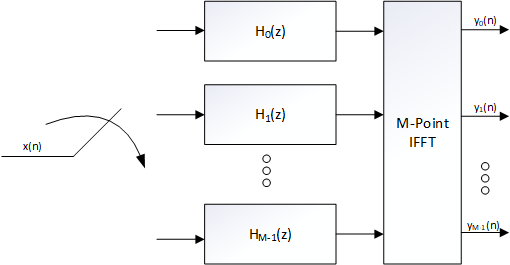

You can implement a 1D IFFT using a 2D IFFT algorithm with higher efficiency overall in cases of larger point size and SSR > 1 regime. This requires resources that span AIE and PL. 

Note: To reproduce any of the steps below, begin by cloning [Vitis_Libraries](https://github.com/Xilinx/Vitis_Libraries) and set DSPLIB_ROOT path to point to the cloned repo path.

## Channelizer Requirements

The following table shows the system requirements for the polyphase channelizer. The sampling rate is 2 GSPS. 
The design supports M=4096 channels with each channel supporting 2G / 4096 = 488.28125 KHz of bandwidth. 
The filterbank used by the channelizer uses K=36 taps per phase, leading to a total of 4096 x 36 = 147456 taps overall.

|Parameter|Value|Units|
|---|---|---|
| Sampling Rate (Fs) | 2 | GSPS |
| # of Channels (M) | 4096 | channels |
| Channel Bandwidth | 488.28125 | KHz |
| # of taps per phase (K) | 36 | n/a |
| Input datatype | cint16 | n/a |
| Output datatype | cint32 | n/a |
| Filterbank coefficient type | int32 | n/a |
| FFT twiddle type | cint16 | n/a |

## System Partitioning

System Partitioning is the process of designing an embedded system for heterogeneous compute.
This involves analyzing the polyphase channelizer algorithm characteristics and its functional blocks to identify which block should be implemented in AI Engines versus PL, and establish a data flow with sufficient bandwidth to support the required computations.
For more information on system partitioning methodology, refer to *Versal Adaptive SoC System and Solution Planning Methodology Guide* [(UG1504)](https://docs.amd.com/r/en-US/ug1504-acap-system-solution-planning-methodology/AI-Engine-System-Partitioning-Planning).

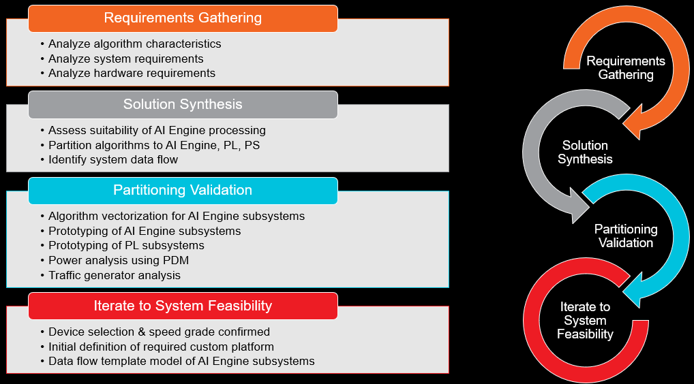

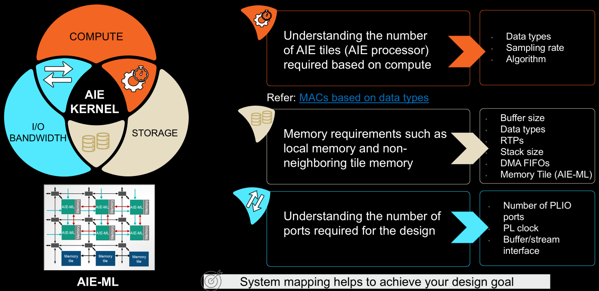

The channelizer has two fundemental building blocks and those are the Polyphase Filterbank and IFFT.
The approach of this tutorial is to analyze compute, storage and I/O bandwidth requirements for the filterbank and IFFT to understand how many AI Engine tiles are expected to be used.
We will then instantiate and characterize the IP blocks and look for optimization opportunities. 

### Filterbank System Partitioning

#### Filterbank Compute Requirements

The filterbank has a total of 4096 channels, each with 36 taps of type int32. The sampling rate of each channel is 2e9/4096 = 488.28125 Ksps.

Based on the specified data and coefficient types, AI Engine should be able to perform 8 `cint16` x `int32` MACs every cycle in a single tile.
For more information, refer to Table 1 of the *Versal Adaptive SoC AIE-ML Architecture Manual* [(AM020)](https://docs.amd.com/r/en-US/am020-versal-aie-ml/Functional-Overview). 

Assuming we use part `xcve2802-vsvh1760-2MP-e-S`, AI Engine can be clocked at 1.25 GHz, as described in *Versal AI Core Series Data Sheet: DC and AC Switching Characteristics* [(DS957)](https://docs.amd.com/r/en-US/ds957-versal-ai-core/AI-Engine-Switching-Characteristics).
A general rule of thumb is to reserve some margin for processor overhead in the range of 20-25%.

The number of tiles required based on compute-bound analysis = 2e9 x 36 / 8 / 1.25e9 x 1.25 = 9 tiles.

#### Filterbank Storage Requirements

The filterbank requires storage for the filter coefficients and state, requiring 8 Bytes and 4 Bytes per coefficient or sample.
Total storage required for the filterbank = 4096 x 36 x 4B + 4096 x 35 x 4B = 1136 KB.

A single AIE-ML tile has 64 KB of local tile memory and has access to three neighboring tile memories for a total size of 256 KB.
Some storage needs to be reserved for sysmem, which is required by the processor to store stack and heap.

This leads to a solution which requires ~18 tiles for the filterbank. Rounding up to a power of 2 results in a simpler PL solution to avoid managing state.
Number of tiles based on storage-bound analysis = 32 tiles.

#### Filterbank I/O Bandwidth Requirements

The filterbank needs to run at 2 GSPS, with cint16 inputs and cint32 outputs.

Based on AIE-ML interfaces specified data in the *Versal Adaptive SoC AIE-ML Architecture Manual* [(AM020)](https://docs.amd.com/r/en-US/am020-versal-aie-ml/AIE-ML-Interfaces), a single stream delivers 32-bits per cycle.

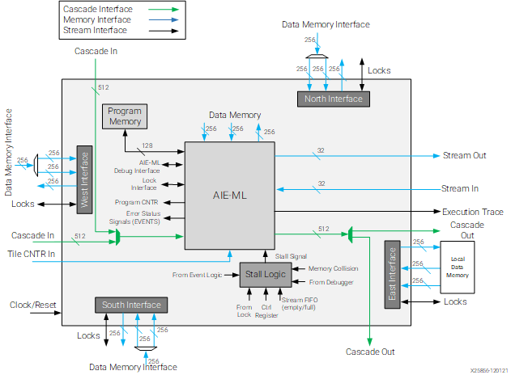

For the chosen I/O datatypes and sampling rate, bandwidth requirement translates to two input PLIO ports and four output PLIO ports.

#### Filterbank Library Characterization

Based on the analysis above, we learned that our filterbank will be storage-bound, requiring 32 tiles. 
We can instantiate the TDM FIR IP based on the configuration below. For more information on the definition of these parameters, refer to [Vitis Libraries](https://docs.amd.com/r/en-US/Vitis_Libraries/dsp/rst/class_xf_dsp_aie_fir_tdm_fir_tdm_graph.html).

```
  typedef cint16                      TT_DATA;
  typedef cint32                      TT_OUT_DATA;
  typedef int32                       TT_COEFF;
  static constexpr unsigned           TP_FIR_LEN            = 36;
  static constexpr unsigned           TP_SHIFT              = 31;
  static constexpr unsigned           TP_RND                = 12;
  static constexpr unsigned           TP_NUM_OUTPUTS        = 1;
  static constexpr unsigned           TP_DUAL_IP            = 0;
  static constexpr unsigned           TP_SAT                = 1;
  static constexpr unsigned           TP_TDM_CHANNELS       = 4096;
  static constexpr unsigned           TP_SSR                = 32;
  static constexpr unsigned           TP_INPUT_WINDOW_VSIZE = 4096;
  static constexpr unsigned           TP_CASC_LEN           = 1;
```

We can characterize its performance to confirm it works as expected.

```
[shell]% cd <path-to-design>/aie/tdm_fir_characterize
[shell]% make clean all
[shell]% vitis_analyzer aiesimulator_output/default.aierun_summary
```

Inspecting vitis_analyzer, we observe that the design uses more tiles than expected (64 vs 32 predicted).

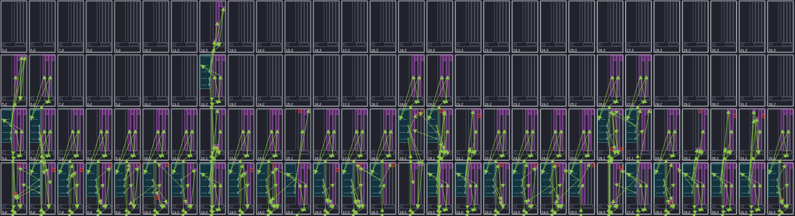

Zooming in to one of the tiles, we observe that the state history is stored with the input window, which is double-buffered.
This causes the storage requirement to increase beyond the predicted 32 tiles. This observation is specific to the TDM FIR IP on AIE-ML.

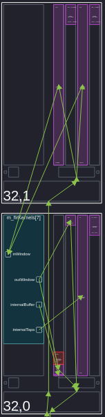

We also observe that the achieved throughput is higher than the requirement, 4096/1.253 = 3270 MSPS.

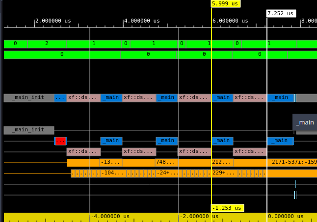

It is possible to trade-off throughput for storage.

#### Filterbank Library Optimization
You can use the following approach to tradeoff throughput for storage:
* Apply `single_buffer` constraint on the input. For more information, refer to *AI Engine Kernel and Graph Programming Guide* [UG1076](https://docs.amd.com/r/en-US/ug1079-ai-engine-kernel-coding/Buffer-Allocation-Control).
* Add placement constraints to store each tile's storage requirements locally.

Code snippet below taken from `<path-to-design>/aie/tdm_fir/firbank_app.cpp` shows an example of how this can be done.

```
  single_buffer(dut.tdmfir.m_firKernels[ii+0].in[0]);
  std::string file_i0 = "data/filterbank_i_" + std::to_string(ii) + ".txt";
  std::string file_o0 = "data/filterbank_o_" + std::to_string(ii) + ".txt";
  sig_i[ii] =  input_plio::create("PLIO_i_"+std::to_string(ii), plio_64_bits, file_i0 );
  sig_o[ii] = output_plio::create("PLIO_o_"+std::to_string(ii), plio_64_bits, file_o0 );
  connect<>(     sig_i[ii].out[0], dut.sig_i[ii] );
  connect<>( dut.sig_o[ii],            sig_o[ii].in[0] );
  location<kernel>   (dut.tdmfir.m_firKernels[ii])                 =      tile(start_index+xoff,0);
  location<stack>    (dut.tdmfir.m_firKernels[ii])                 =      bank(start_index+xoff,0,3);
  location<parameter>(dut.tdmfir.m_firKernels[ii].param[0])        =      bank(start_index+xoff,0,3);
  location<parameter>(dut.tdmfir.m_firKernels[ii].param[1])        =   address(start_index+xoff,0,0x4C00);
  location<buffer>   (dut.tdmfir.m_firKernels[ii].in[0])           =      bank(start_index+xoff,0,0);
  location<buffer>   (dut.tdmfir.m_firKernels[ii].out[0])          = {    bank(start_index+xoff,0,1), bank(start_index+xoff,0,3) };
```

Compile and simulate the design to confirm it works as expected.

```
[shell]% cd <path-to-design>/aie/tdm_fir
[shell]% make clean all
[shell]% vitis_analyzer aiesimulator_output/default.aierun_summary
```

Inspecting vitis_analyzer, we observe that our resource count dropped to 32 tiles with a throughput = 4096/1.837us = 2230 MSPS.

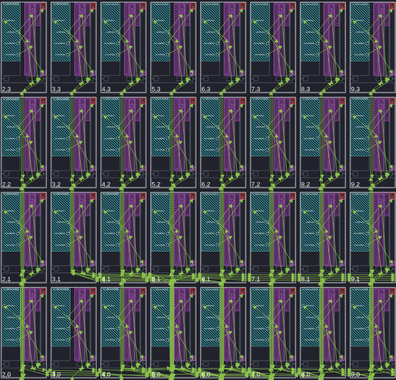


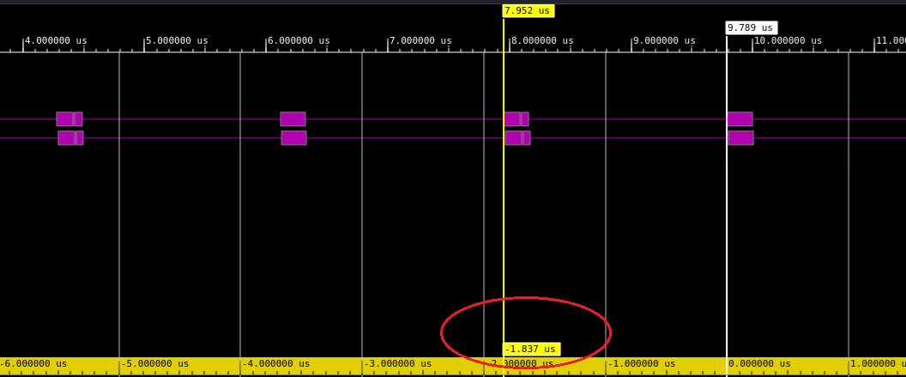

### IFFT-2D System Partitioning

In this tutorial, we explore the use of 2D IFFT IP to implement a 4K-pt IFFT @ 2 GSPS. The resources span AIE + PL.
We need to characterize a single instance of the IP and measure throughput to understand how many instances we need to meet performance.


#### IFFT-2D Library Characterization

The first step is to characterize the 2D IFFT AI Engine IP, that is, vss_fft_ifft_1d_graph, to understand the optimal configuration to meet our requirements.

We can instantiate vss_fft_ifft_1d_graph based on the configuration below. The main choice you have to make as part of this exercise is what TP_SSR is sufficient to meet our throughput requirement. We begin assuming that TP_SSR=1 and adjust as needed.
For more information on the definition of these parameters, refer to [Vitis Libraries](https://docs.amd.com/r/en-US/Vitis_Libraries).

```
  typedef cint32            TT_DATA;
  typedef cint16            TT_TWIDDLE;
  static constexpr unsigned TP_POINT_SIZE = 4096;
  static constexpr unsigned TP_FFT_NIFFT = 0;
  static constexpr unsigned TP_SHIFT = 0;
  static constexpr unsigned TP_CASC_LEN = 1;
  static constexpr unsigned TP_API = 0;
  static constexpr unsigned TP_SSR = 1;
  static constexpr unsigned TP_USE_WIDGETS = 0;
  static constexpr unsigned TP_RND = 12;
  static constexpr unsigned TP_SAT = 1;
  static constexpr unsigned TP_TWIDDLE_MODE = 0;
```

Note that vss_fft_ifft_1d_graph is made up of three AI Engine kernels:
* Front FFT/IFFT
* Point-wise twiddle multiplication
* Back FFT/IFFT

In `<path-to-design>/aie/ifft4096_2d_characterize/ifft4096_2d_app.cpp`, we have added a location constraint to place the first two kernels in the same tile.
```
location<kernel>(dut.ifft4096_2d.m_fftTwRotKernels[ff]) = location<kernel>(dut.ifft4096_2d.frontFFTGraph[ff].FFTwinproc.m_fftKernels[0]);
```
The next step is to characterize its performance.

```
[shell]% cd <path-to-design>/aie/ifft4096_2d_characterize
[shell]% make clean all
[shell]% vitis_analyzer aiesimulator_output/default.aierun_summary
```

Inspecting vitis_analyzer, we can read two throughput numbers:
First,  4096/8.914us = 460 MSPS, corresponding to the tile performing front 64-point IFFT + point-wise twiddle multiplication.
Second, 4096/7.604us = 539 MSPS, corresponding to the tile performing the back 64-point IFFT.

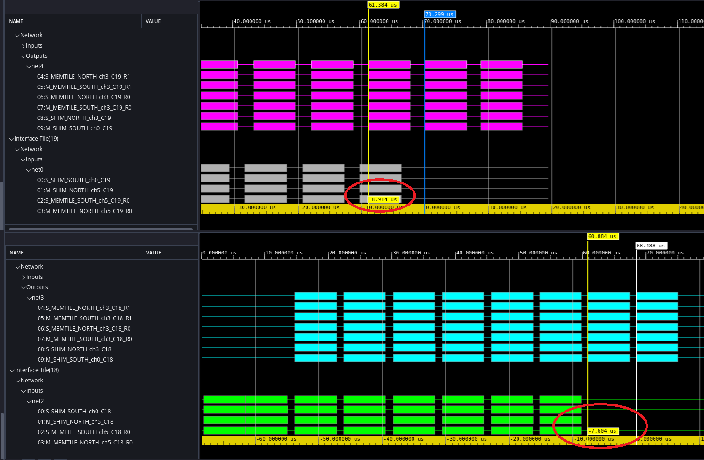

This means, we need SSR=5 to meet our target throughput of 2 GSPS.

#### IFFT-2D Library Optimization

While an SSR=5 should be sufficient from a resource count perspective, using a SSR that is a power of 2 simplifies the overall design and allows thr direct mapping of TDM FIR outputs into 2D IFFT input.
For this reason, we proceed with SSR=8. We can also apply the `single_buffer` constraint on the input and output buffer to reduce the storage requirements at the expense of some degradation in throughput.

```
[shell]% cd <path-to-design>/aie/ifft4096_2d
[shell]% make clean all
[shell]% vitis_analyzer aiesimulator_output/default.aierun_summary
```

Inspecting vitis_analyzer, we observe a resource count of 16 AIE-ML tiles.
Achieved throughput for:
* Front 64-point IFFT + point-wise twiddle multiplication = 2295 MSPS
* Back 64-pint IFFT = 2288 MSPS

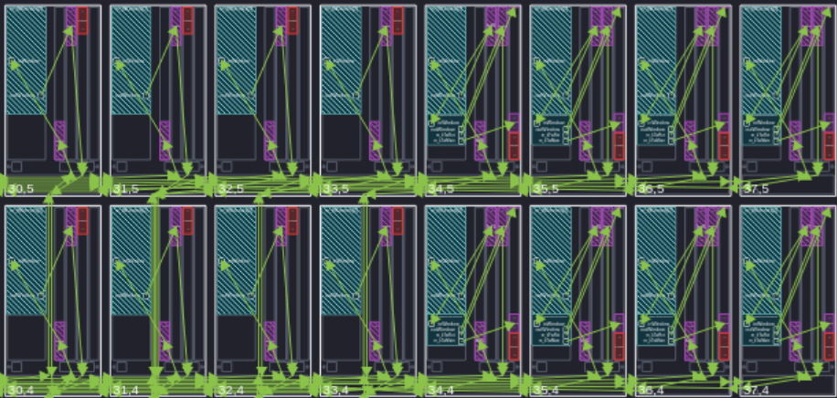

For the transpose blocks, you can implement these in the PL using block RAMs. The PL is assumed to be clocked at 312.5 MHz.
A single block RAM stores up to 36 Kbits, and can be configured as 512 x 72 bits with one write and one read port.
For more information on block RAMS, refer to [Versal ACAP Memory Resources Architecture Manual](https://docs.amd.com/r/en-US/am007-versal-memory/Block-RAM?tocId=4P4QDFML7TiXdlJaQlcRog).
A single transform contains 4096 samples, 64 bits each. To achieve our desired throughput, we require two write and two read ports.
The IFFT transpose blocks that exist in `${DSPLIB_ROOT}/L1/src/hw` are implemented using ping-pong buffers for storage.

Given this, we expect our BRAM count per transpose block to be = 4096 / 512 x 2 x 2 = 32.

### Design Summary

- TDM FIR uses 32 AI Engine tiles with 32 IO streams
- The 4k-pt IFFT is implemented using 2D architecture with resources split between 16 AI Engine tiles (compute) and PL (data transpose).
- From a bandwidth perspective, the design requires 2 input and 4 output streams.
- Custom HLS blocks (merge and split) are built to manage connectivity between the IPs.

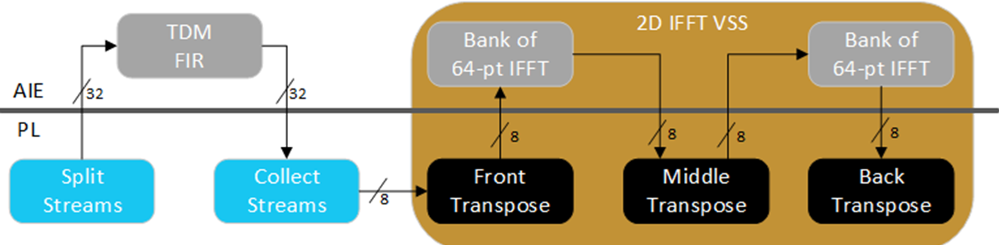

## Design Resources

The following figure summarizes the AI Engine and PL resources required to implement the design in the VE2802 device on the VEK280 eval board. The design is using 48 AI Engine tiles for compute. The PL design includes the resources required to implement the DMA Source, Stream Split/Merge, Memory Transpose, and DMA Sink kernels.


Below is a list of potential improvements that could be made to reduce resource count:
- Reduce the number of AIE-ML tiles used by 2D FFT IP from 16 to 10 (by changing TP_SSR from 8 to 5). This requires increased complexity of the HLS managing the connectivity from the TDM FIR output to the 2D FFT input due to state handling.
- Optimize implementation of HLS transpose blocks to avoid use of ping-pong buffers. This should half the number of the required block RAMs.

## Build and Run Design

You can build the polyphase channelizer design from the command line.

### Setup & Initialization

IMPORTANT: Before beginning the tutorial, ensure you have installed AMD Vitis™ 2024.2 software. Ensure you have downloaded the Common Images for Embedded Vitis Platforms from [this link](https://www.xilinx.com/support/download/index.html/content/xilinx/en/downloadNav/embedded-platforms.html).

Set the environment variable ```COMMON_IMAGE_VERSAL``` to the full path where you have downloaded the Common Images. Then set the environment variable ```PLATFORM_REPO_PATHS``` to the value ```$XILINX_VITIS/base_platforms```.

The remaining environment variables are configured in the top level Makefile ```<path-to-design>/Makefile``` file.

### Hardware Emulation

You can build the channelizer design for hardware emulation using the Makefile as follows:

```
[shell]% cd <path-to-design>
[shell]% make all TARGET=hw_emu
```

This takes about 90 minutes to run. The build process generates a folder ```package``` containing all the files required for hardware emulation.
This runs as shown below.
An optional `-g` can be applied to the ```launch_hw_emu.sh``` command to launch Vivado waveform GUI to observe the top-level AXI signal ports in the design.

```
[shell]% cd <path-to-design>/package
[shell]% ./launch_hw_emu.sh -g -run-app embedded_exec.sh
```
After hardware emulation run is complete, the following is displayed on the terminal.

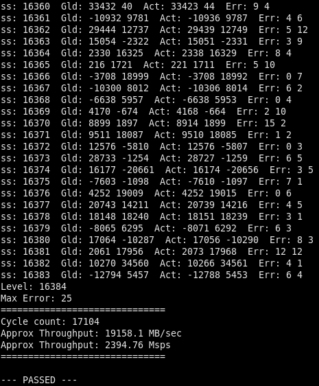

### Hardware

You can nuild the channelizer design for the VEK280 board using the Makefile as follows:

```
[shell]% cd <path-to-design>
[shell]% make all TARGET=hw
```

The build process generates the SD card image in the ```package/sd_card``` folder.
After flashing sd_card.img into the sd card, power on the board and run the design.
The following is displayed on the terminal.

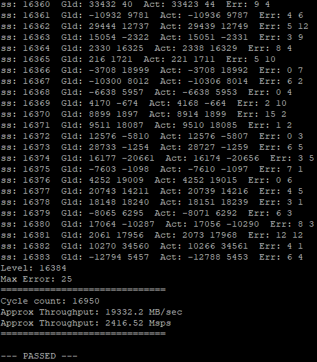

## References

[1]: <https://ieeexplore.ieee.org/document/1193158> "Digital Receivers and Transmitter Using Polyphase Filter Banks for Wireless Communications, F.J. Harris et. al."

[[1]] F.J. Harris et. al., "[Digital Receivers and Transmitter Using Polyphase Filter Banks for Wireless Communications](https://ieeexplore.ieee.org/document/1193158)", IEEE Transactions on Microwave Theory and Techniques, Vol. 51, No. 4, April 2003.

## Support

GitHub issues are used for tracking requests and bugs. For questions, go to [Support](https://adaptivesupport.amd.com/s/?language=en_US).

## License

<p class="sphinxhide" align="center"><sub>Copyright © 2023-2024 Advanced Micro Devices, Inc</sub></p>
<p class="sphinxhide" align="center"><sup><a href="https://www.amd.com/en/corporate/copyright">Terms and Conditions</a></sup></p>
