<!--
Copyright (C) 2024, Advanced Micro Devices, Inc. All rights reserved.
SPDX-License-Identifier: MIT
Author: Mark Rollins
-->
<table class="sphinxhide" width="100%">
 <tr width="100%">
    <td align="center"><h1>AI Engine Development</h1>
    <a href="https://www.xilinx.com/products/design-tools/vitis.html">See Vitis™ Development Environment on xilinx.com</br></a>
    <a href="https://www.xilinx.com/products/design-tools/vitis/vitis-ai.html">See Vitis™ AI Development Environment on xilinx.com</a>
    </td>
 </tr>
</table>

# MNIST ConvNet on AIE-ML

***Version: Vitis 2024.2***

## Table of Contents

1. [Introduction](#introduction)
2. [Jupyter Notebook Model](#jupyter-notebook-model)
3. [AIE-ML Inference Solution](#aie-ml-inference-solution)
4. [Individual Layer Designs](#individual-layer-designs)
5. [Summary](#summary)

[References](#references)

[Support](#support)

[License](#license)

## Introduction

This tutorial implements a Convolutional Neural Network classifier on AMD Versal<sup>TM</sup> adaptive SoC AIE-ML for identifying hand-written digits from the [MNIST database](https://en.wikipedia.org/wiki/MNIST_database). The goal is to illustrate how to partition & vectorize a simple machine learning example to Versal AI Engines. An MNIST ConvNet classifier makes a good learning example because it contains only ~100,000 parameters and a handful of layers. This tutorial example illustrates a number of key topics fundamental to custom coding machine learning designs using the AIE API including:
* Using multi-channel matrix multiply intrinsics to vectorize ConvNet layer compute workloads
* Using 3D addressing patterns of memory tiles to access layer I/O in the order required for consumption by the compute
* Using local tile memory for capturing stored network weights
* Structuring AIE-ML kernel code to implement convolutional & pooling layers efficiently

### Virtual Python Environment Setup
This tutorial implements computer models of the MNIST ConvNet in Python using Jupyter Notebooks. This is best managed using a Python virtual environment. The first step of this tutorial involves setting up such a virtual environment with the required versions of all the associated open source Python packages. The top level Makefile of this tutorial builds the Python virtual environment based on a script `create_venv.sh` which creates the environment and then loads a set of specific versions of all required Python packages. To create this Python virtual environment, run the following code:
```
% make venv
% source my-venv/bin/activate
% python --version
```
This will create a folder `my-venv` in the top-level folder containing all the required packages for Jupyter Notebooks, TensorFlow, matplotlib, pydot, and bfloat16 (including any and all dependencies) required by the tutorial. The second command activates the Python environment. The third command displays the version of Python used to create the virtual environment. This tutorial has been built and tested using Python 3.10.4.

## Jupyter Notebook Model

The first step of this tutorial is to build a computer model of the MNIST ConvNet and to train the model to obtain a set of weights that may be used for inference. The tutorial uses the [Keras](https://keras.io) framework for this purpose. Keras provides a simple, flexible, and powerful framework built on top of TensorFlow for building machine learning network models. The full Jupyter Notebook of this model is provided by [MNIST-Convnet-demo.ipynb](MNIST-Convnet-demo.ipynb). To run the notebook, execute the following command:
```
% jupyter-notebook MNIST-Convnet-demo.ipynb
```

The Keras model for the MNIST ConvNet classifier originates as an [example](https://keras.io/examples/vision/mnist_convnet/) on the Keras website and is given by the following Python code:
```
inputs = keras.Input(shape=(28,28,1),name="input")
    x1 = layers.Conv2D(filters=16,kernel_size=3,activation="relu",name="conv2d_w1")(inputs)
    x2 = layers.MaxPooling2D(pool_size=2,name="max_pooling2d_w2")(x1)
    x3 = layers.Conv2D(filters=64,kernel_size=3,activation="relu",name= "conv2d_w3")(x2)
    x4 = layers.MaxPooling2D(pool_size=2,name="max_pooling2d_w4")(x3)
    x5 = layers.Conv2D(filters=128,kernel_size=3,activation="relu",name="conv2d_w5")(x4)
    x6 = layers.Flatten(name="flatten_w6")(x5)
    outputs = layers.Dense(10,activation="softmax",name="dense_w7")(x6)
    model = keras.Model(inputs=inputs,outputs=outputs)
    model.compile(optimizer="rmsprop",
                  loss="sparse_categorical_crossentropy",
                  metrics=["accuracy"])
```
The network contains seven layers:
* The first layer is a 2D convolutional layer applying sixteen 3x3 convolutional kernels to the input layer, and applying a ReLU activation function at its output. Each kernel has its own set of 3 x 3 = 9 multiplicative weights along with a single additive bias weight. It follows the total weights for this layer is 16 x (9+1) = 160.
* The second layer implements a "max pooling" layer that performs a decimation-by-two in both image dimensions. There are no weights associated with this layer.
* The third layer implements another 2D convolutional  layer this time with 64 3x3 convolutional kernels, and applying a ReLU activation function at its output. This layer involves a total of 16 x 64 x 9 = 9,216 multiplicative weights and 64 additive bias weights for a total of 9,280 weights.
* The fourth layer implements another "max pooling" layer in two dimensions with no additional weights.
* The fifth layer implements a third 2D convolutional layer with 128 3x3 convolutional kernels, and applying a ReLU activation at its output. This layer uses a total of 64 x 128 x 9 = 73,728 multiplicative weights and 128 additive bias weights for a total of 73,856 weights.
* The sixth layer performs a flattening function, collapsing the total of 3 x 3 x 128 = 1,152 connections into a single 1D bus.
* The seventh layer consists of a fully connected dense network of 1152 x 10 = 11,520 multiplicative weights and 10 additive bias weights for a total of 11,530 weights.

The total # of weights for this network is 94,826 or approximately 100,000 weights. This is a small ConvNet. The diagram below summarizes the layers of the MNIST ConvNet.

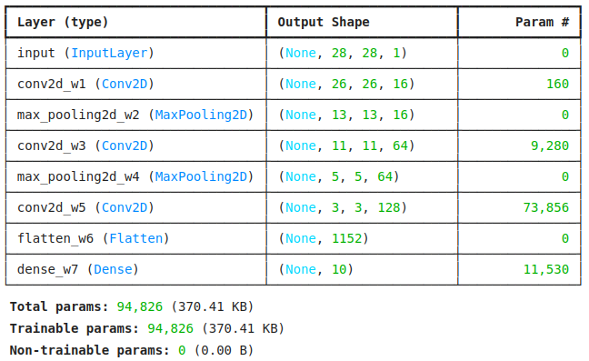

### Import the MNIST Image Database

The MNIST ConvNet must be trained on the MNIST image database. This database contains 60,000 images of hand-written digits and is distributed as part of the Keras/TensorFlow package.The [MNIST-Convnet-demo.ipynb](MNIST-Convnet-demo.ipynb) selects 3750 x 16 images for training the network in batches of 16 and another 512 x 16 images for testing the trained network in batches of 16. Each image is represented by 28 x 28 monochromatic pixels (in the range 0 to 255). Code for extracting these training and testing image sets is shown below, along with examples of eight of these hand-written images.
```
BS=16
NB_trn = 3750
NB_tst = 512
# Load MNIST database:
(trn_images,trn_labels), (tst_images,tst_labels) = mnist.load_data()
trn_images = trn_images.reshape((60000,28,28,1))
trn_images = trn_images[:NB_trn*BS,:,:,:]
tst_images = tst_images.reshape((10000,28,28,1))
# Extract usable data:
tst_images = tst_images[:NB_tst*BS,:,:,:]
trn_labels = trn_labels[:NB_trn*BS]
tst_labels = tst_labels[:NB_tst*BS]
fig,ax = plt.subplots(nrows=2,ncols=4)
for rr in range(2):
   for cc in range(4):
      ax[rr,cc].imshow(trn_images[4*rr+cc],cmap=plt.cm.binary)
```

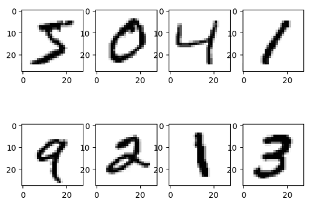

### Training & Testing the MNIST ConvNet Model

The Keras framework provides built-in functions for training and testing the model. These are shown below. Training is performed on the set of training images. The labelled data set is used to drive back-propagation algorithms to adjust the weights to minimize the chosen cost function (in this case "sparse categorical cross-entropy"). An "accuracy" metric is chosen to assess quality of result. After five training epochs, the network accuracy of 99.1% is achieved on the test data set. 

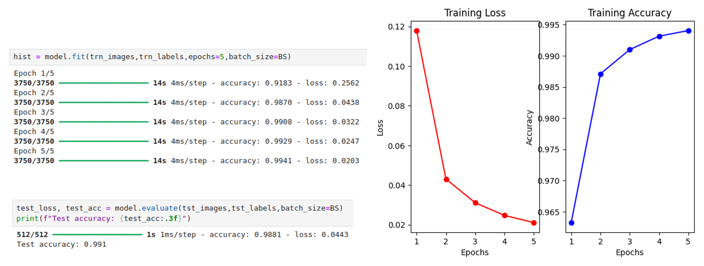

### Using the MNIST ConvNet for Inference

Another built-in Keras routine may be used for inference to predict new model outputs from test input images. The code below shows this for four example images which have been labelled with the (correct) digit identifications produced by the ConvNet.


### Extracting Weights & Biases for AIE-ML Inference Solution

Now having obtained a trained model for the MNIST ConvNet classifier, the last step required prior to building an inference solution on AIE-ML is to obtain a quantized set of weights to be used by the implementation. For simplicity in this tutorial, a `bfloat16` implementation is chosen because quantization is straightforward. Each weight & bias uses the same exponent but a quantized mantissa of only 8 bits as opposed to the 24-bits used by the full precision floating point values produced by the Keras network model. The code below extracts the weights & biases from the Keras model, quantizes them to `bfloat16` and then saves them in files for validating each layer of the network to be designed in AIE-ML below.

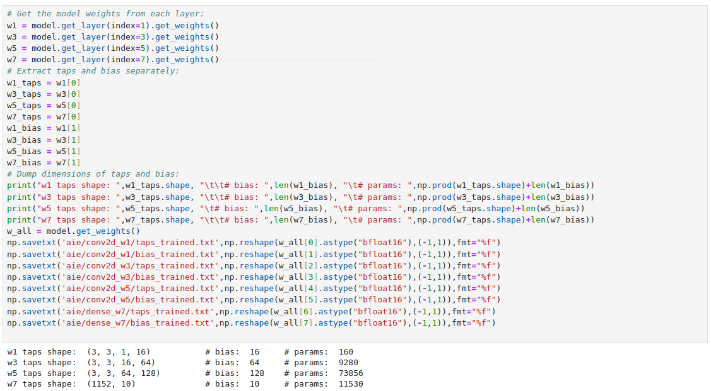

## AIE-ML Inference Solution

This section provides an overview of the final AIE-ML design for the MNIST ConvNet classifier, including a review of key principles that are leveraged across all the layers in the design. Details for each individual layer are then given in [Individual Layer Designs](#individual-layer-designs).

### Design Approach

This tutorial adopts a simple design approach to building the MNIST ConvNet classifier in AIE-ML geared towards establishing workable data flows and identifying efficient AIE API coding strategies for common convolutional and pooling layers. The focus is not on throughput performance nor resource utilization but instead to identify a suite of design techniques that may be applied to more advanced designs. The design approach adopts the following concepts:

* The `bfloat16` data type is chosen for both layer I/O data and for weights & biases. This simplifies the quantization of trained network parameters. No special tools nor quantization strategies are required. 
* No specific throughput target is chosen. The design is a toy example and so its performance is not of practical interest.
* The design generally partitions each network layer to its own AIE-ML tile where feasible. This simplifies system partitioning and allows a well-defined scope for each AIE-ML kernel to be built.
* Memory tile zero-padding capability is leveraged to expand input tensor shapes from (28,28,1) to (28,32,1) to satisfy AI Engine memory alignment and PLIO bit width requirements.
* Memory tile multi-dimensional addressing capabilities are leveraged to efficiently transfer I/O data for compute consumption with minimal core cycles being required for data shuffling or lane adjustments within the core.
* Compute workloads for 2D convolutional layers leverage the efficient `mac_4x8_8x4()` intrinsic for `bfloat16` data types to achieve a maximum efficiency of 128 MAC operations per cycle when feasible by a particular layer.
* Compute workloads leverage the less efficient `mac_elem_16_2()` intrinsic for `bfloat16` data types with a maximum efficiency of 64 MAC operations per cycle in cases where `mac_4x8_8x4()` is not feasible (for example in the `conv2d_w1()` layer which only receives data from a single input channel).
* The design combines the `flatten_w6()` and `dense_w7()` layers to the same AIE-ML tile. 
* Weights & biases are stored in local tile memory instead of in memory tiles because the former admit a means to establish a read-only access scheme using asynchronous buffers that permits the weights to be read only once at startup. Larger ML networks with millions of weights require streaming solutions based on memory tiles; such a complex solution is excessive for the small MNIST problem considered here where all weights may be stored easily within the array. Extending the programming model to support read-only operation in memory tiles is under development.

### Vitis Functional Simulation

This tutorial uses a new tool feature called Vitis Functional Simulation (VFS) to validate the MNIST ConvNet classifier AI Engine implementation against its Python behavioral models. The VFS feature generates executable "shared objects" of the AI Engine and PL portions of your heterogenous Versal design, allowing it to be brought into familiar simulation frameworks, namely MATLAB and Python. This allows functional verification of your Versal AI Engine and PL designs without leaving your preferred simulation framework and without creating I/O files for this purpose.

Vitis Functional Simulation is an EA tool feature in 2024.2. To obtain instructions and design examples, request access to the [Vitis Functional Simulation Early Access Secure Site](https://account.amd.com/en/member/vitis-functional-simulation.html).

The Python version of Vitis Functional Simulation is used to validate each network layer in the MNIST ConvNet design. The screen capture below shows how the `conv2d_w1()` layer is called from the Jupyter notebook [gen_vectors.ipynb](aie/conv2d_w1/gen_vectors.ipynb) used to validate that layer. A similar notebook is built for each layer in the design. The VFS infrastructure compiles the AI Engine graph automatically under the hood when any source code files change, and then passes the I/O vectors between the Jupyter notebook and the x86 functional simulator. 

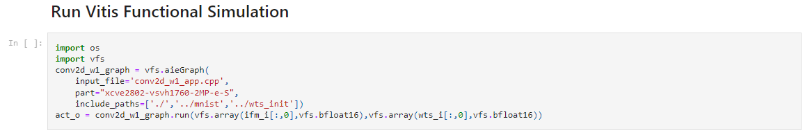

### MNIST ConvNet: AI Engine Graph View

The overall AI Engine graph of the MNIST ConvNet classifier is shown in the diagram below. 

* Each layer is generally assigned to its own AIE-ML tile as outlined above. 
* Layers with weights & biases contain two AIE-ML tiles. One tile performs the compute workload on the input images. Weights are delivered to this compute tile from a buffer filled once at startup from a second "weight delivery" tile. An asynchronous buffer mechanism reads the weights at design startup from the PLIO and delivers them to the weight input buffer. The compute tile may then access these weights continuously as the design runs.
* The `conv2d_w5()` layer is partitioned over four tiles to manage the weight storage which is too large to fit into the available 32 KB of local tile storage (ping/pong buffers are limited to 32 KB since they must be allocated to the same 64 KB local tile memory). Based on its ~74,000 parameters the storage must be split over a minimum of four AIE-ML tiles. Its compute workload is also partitioned over the four tiles, with each tile computing one quarter of the output layer samples. Further details are outlined below. 
* The last AIE-ML tile contains the `flatten_w6()` layer, the `dense_w7()` layer, and the `softmax()` compute workload to produce the final classifier output.
The max pooling layers `max_pooling2d_w2()` and `max_pooling2d_w4()` do not have any weights and so are implemented using a single AIE-ML tile each.

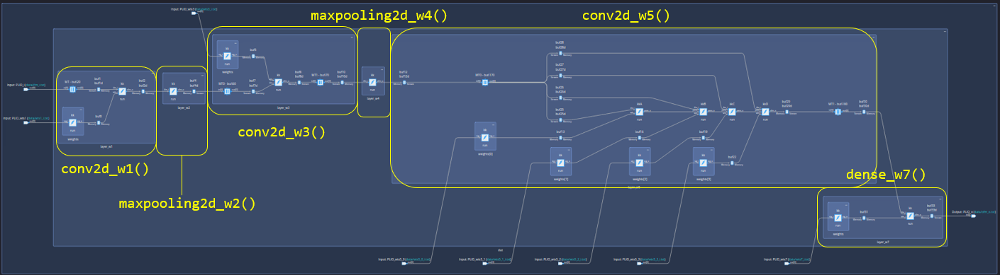

### MNIST ConvNet: AI Engine Floorplan View

The floorplan view of the MNIST ConvNet classifier is shown in the diagram below. Placement constraints place the compute tiles in the top row of tiles and the weight delivery tiles in the lower row of tiles. The design uses memory tiles for layer I/O ordering and zero padding as outlined in more detail below.  

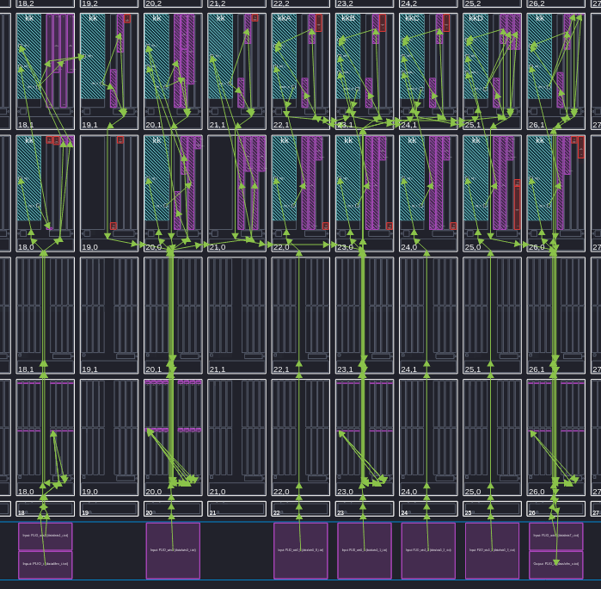

### MNIST ConvNet: AI Engine Resource Utilization

The resource utilization of the design is given in the figure below. The design fits into a 2 x 9 grid of tiles and utilizes five memory tiles for shared buffers.

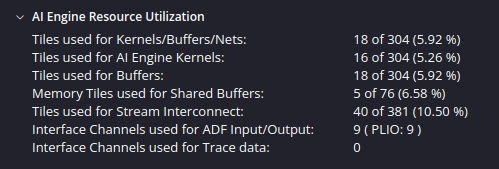

### Vectorization of 3x3 Conv2D Layer Processing

The 2D convolutional layers in the MNIST ConvNet use 3x3 patch processing as outlined in the figure below. Each layer has a number of input channels $C_I$ of images of size $H_I\times W_I$ pixels. Each of these input images is processed by the 3x3 patch to produce a number of output channels $C_O$ of images of size $H_O\times W_O$ pixels where $H_O=H_I-2$ and $W_O=W_I-2$. An outer border of one pixel width is lost in the output images to allow the 3x3 patch to fully span the input image without exceeding its borders. The 3x3 patch processing involves computing nine point-wise products of the input image pixels with the 9 weights of the 3x3 patch and summing the results. A bias term is added to the sum and this gives the output value for the output pixel at the center of the 3x3 patch. The diagram below shows a $5\times 5$ input image and its corresponding $3\times 3$ output image. Each output pixel is computed by moving the patch one pixel to the right across the image, and then repeating this procedure along every row in the output image. Each input/output layer pair has a unique set of 9 weights + 1 bias for the 3x3 patch used to compute a specific output layer from a specific input layer. 

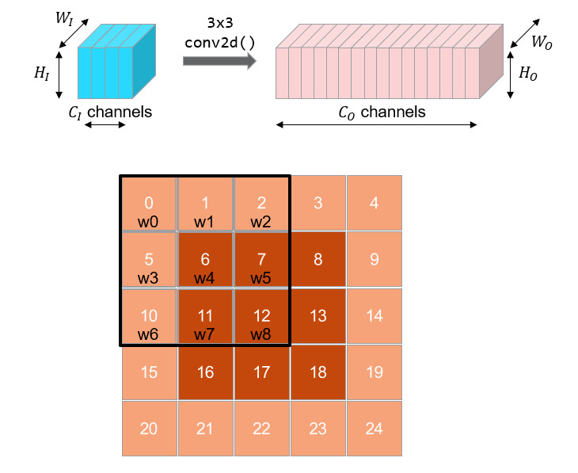

AIE-ML data path is optimized for matrix multiplication, and it turns out the 3x3 convolutional processing outlined above can be cast into this form. The diagram below shows the compute performed by the `mac_4x8_8x4()` intrinsic for the `bfloat16` data type in AIE-ML. This intrinsic performs matrix multiplication of the form $M=X\times Y$, where matrix $X$ has size $[A\times B]$, matrix $Y$ has size $[B\times C]$ and matrix $M$ has size $[A\times C]$. In this case, $A\times B\times C = 4\times 8\times 4$. The input matrix $X$ is $4\times 8$, the input matrix $Y$ is $8\times 4$ and the output matrix $M$ is $4\times 4$.

The diagram below shows how this intrinsic may be loaded to perform 3x3 convolutional layer processing. Input matrix $X$ may be loaded with 8 channels of 4 pixels each, where the pixels are stored in columns for each channel. AI Engine maps this input matrix in row-major order into its vector lanes. So we can consider matrix $X$ getting mapped into a 32-lane register where the first 8 lanes contain pixel-0 from all 8 channels, the second 8 lanes contain pixel-1 from all 8 channels, and so on. 

The weights may be loaded as columns of matrix $Y$ where each weight $w(C_i,C_o)$ maps from an input channel to an output layer. Since there are 8 rows and 4 columns, each weight maps from 8 input channels to 4 output channels. The weights are not a function of the pixels; the same weights are used across a specific image. 

Based on this vectorization, we can compute in a single cycle 16 output samples (four pixels for each of four output channels) from 32 input samples (four pixels from eight input channels). The trick then for each AIE-ML kernel is to load efficiently these $4\times 8$ input samples and the $8\times 4$ weights continuously to keep the compute busy.

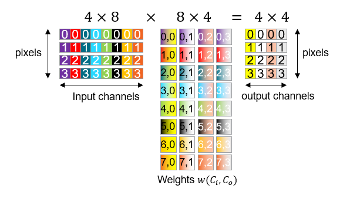

### MNIST ConvNet: Profiling & Vector Load

The table below summarizes the profiling characteristics of the MNIST ConvNet classifier design on AIE-ML. Each function and intrinsic is listed for each layer along with the # of AI Engine cycles required for its implementation. The #MACs column lists the total number of multiply-accumulate operations required in theory for each layer based on its input & output tensor shapes. This may be scaled by the # of MAC operations capable by the silicon to assess an estimate of the average "Vector Load" of each layer. Loads of 13% to 30% to 50% are achieved depending on the specific layer. These values of slightly lower than what is often achieved in "real world" networks. The MNIST ConvNet uses very small images starting at only 28 x 28 pixels. For this reason, the overhead cost is higher because we cannot sustain continuous compute cycles across these small images without falling quickly out of inner compute loops. 

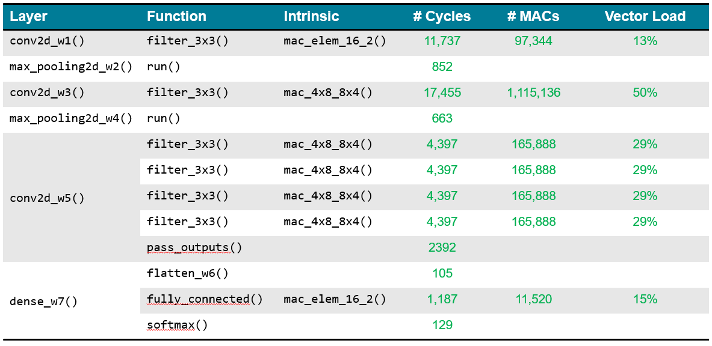

### MNIST ConvNet: Throughput

The throughput of the MNIST ConvNet classifier is approximately ~70,000 frames per second based on AI Engine simulations. This is not interesting from a practical perspective for this small example, but is included for completeness.

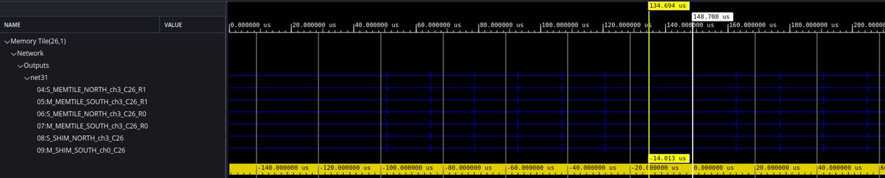

## Individual Layer Designs

### Layer Design Details: `conv2d_w1()`

The figure below summarizes the key aspects of the design of the `conv2d_w1()` layer. The Jupyter Notebook used for validation is [gen_vectors.ipynb](aie/conv2d_w1/gen_vectors.ipynb).

* An input memory tile is used to zero pad the input images from tensors of (28,28,1) to tensors of (28,32,1). This zero padding introduces 4 columns of zeros on the right side of the image so the overall # of columns is a multiple of 32. Only the column dimension requires padding because it forms the inner loop. Because the design uses `bfloat16` data and the memory tiles require 32-bit alignment, the input memory tile is designed to take four images (i.e., with a (4,28,28,1) tensor) and the `conv2d_w1_graph` is set up as a multi-rate solution with a `repetition_count=1` on the memory tile and a `repetition_count=4` on the compute kernel. This is a key principle carried across the full design.
* Because this layer has only a single input channel, the `mac_elem_16_2()` intrinsic is used at 50% capacity; it processes two channels by default and here one channel is zeroed out. This impacts its overall vector efficiency. 
* The inner loop II=17 is achieved to deliver nine MAC operations, which is only  26% efficient. Due to the small nature of the images here it is difficult to fill the pipeline with more MAC operations. This could easily be done in a larger design.
* The overall loop structure employs an outer loop over the output image rows and an inner loop over the output image columns. This is a good fit for the chosen intrinsic.
* Notice how the tiling parameters of the memory tile are used to pad the column dimension of the input images with four additional zero-valued pixels.

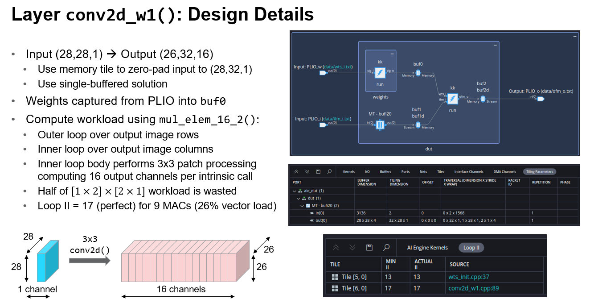

### Layer Design Details: `max_pooling2d_w2()`

The figure below summarizes the key aspects of the design of the `max_pooling2d_w2()` layer. The Jupyter Notebook used for validation is [gen_vectors.ipynb](aie/max_pooling2d_w2/gen_vectors.ipynb).

* Max pooling decimates the input images by a factor of 2 in each dimension by applying a `max()` operation across all four pixels in a 2x2 patch. Successive patches are strided by 2, so they are non-overlapping. This compute workload may be vectorized efficiently using the `aie::max()` function of the AIE API. 
* The layer is coded as an outer loop over the output image rows and an inner loop over the image columns. Vectorization creates 16 output channels for four pixels each. 
* Software pipelining of the inner loop is perfect at II=16.

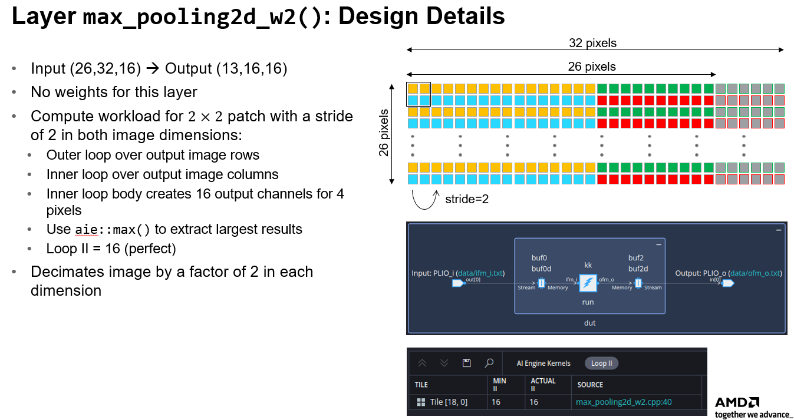

### Layer Design Details: `conv2d_w3()`

The figure below summarizes the key aspects of the design of the `conv2d_w3()` layer. The Jupyter Notebook used for validation is [gen_vectors.ipynb](aie/conv2d_w3/gen_vectors.ipynb).

* The input memory tile writes samples in linear order, consuming the input tensors of shape (13,16,16) in order from the rightmost dimension first (as in the Numpy convention). Samples are extracted from the input memory tile in a tiled fashion such that the samples may be consumed immediately by the compute without any additional shuffling. Tiles of 8 x 16 samples extract 16 pixels from each of 8 input layers. This corresponds to four separate 4 x 8 sample blocks that may be consumed by a `mac_4x8_8x4()` intrinsic. 
* The compute workload is scheduled across an outer loop over output image rows and an inner loop over output image columns. Each compute produces four pixels for four output channels in a single cycle. The layer produces an output tensor shape of (11,16,64). 
* A loop II=12 cycles is achieved for 12 MAC operations (100% inner loop efficiency).
* The output memory tile stores samples in 4x4 tiles such that no output shuffling is required by the core itself; it is handled by the memory tile DMA engine. Samples are written in this tiled manner into the output memory tile so they can be easily extracted in output tensor order (11,16,64) for the subsequent layer to follow.

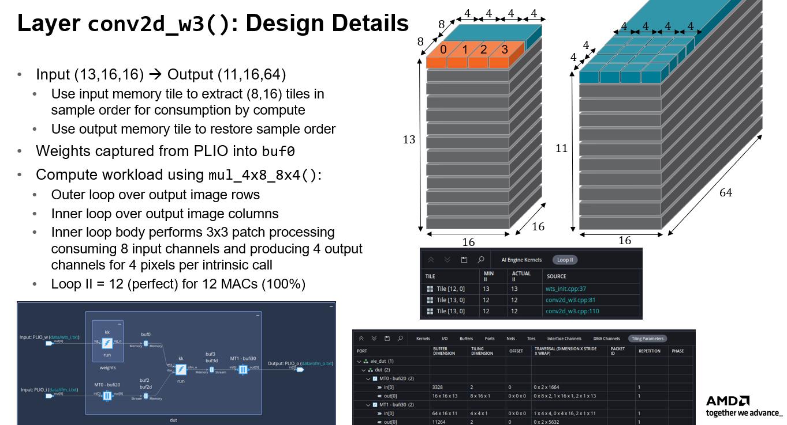

### Layer Design Details: `max_pooling2d_w4()`

The figure below summarizes the key aspects of the design of the `max_pooling2d_w4()` layer. Its design is very similar to the second layer with slightly smaller image dimensions yet more I/O channels to process. The code structure is similar, and an efficient software pipeline scheduling is achieved by the compiler. This layer requires no memory tiles for sample reordering. The Jupyter Notebook used for validation is [gen_vectors.ipynb](aie/max_pooling2d_w4/gen_vectors.ipynb).

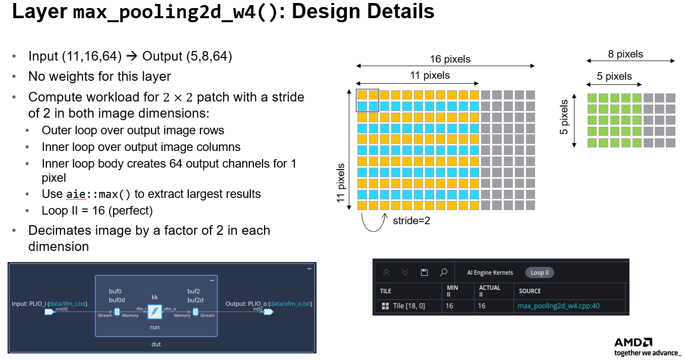

### Layer Design Details: `conv2d_w5()`

The figure below summarizes the key aspects of the design of the `conv2d_w5()` layer. The Jupyter Notebook used for validation is [gen_vectors.ipynb](aie/conv2d_w5/gen_vectors.ipynb). There are a number of unique aspects to this fifth layer:

* This layer is split over four tiles due to the heavy storage requirement of its weights. Each tile processes one quarter of the total output channels, and each local tile memory stores one quarter of the total weights.
* The layer uses input and output memory tiles using an approach similar to the `conv2d_w3()` layer to extract and replace samples in the order required for compute consumption. This leads to efficient utilization of the high performance compute using `max_4x8_8x4()` and leads to a perfect inner loop software pipelining.
* Because computation is partitioned across the four compute tiles, a "collection" function must be performed upon completion of the processing. Output channel results must be passed from each compute tile to the fourth tile for collection and reordering. The design uses I/O streams for this purpose. This requires an additional sample reordering process that is outlined in further detail below.

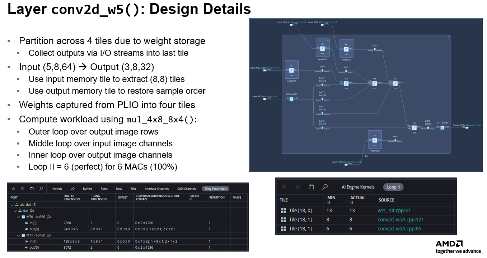

The figure below illustrates the output sample collection process required by the `conv2d_w5()` layer in order to collect & restore sample ordering in the four sets of output channels computed by its four tiles. An input memory tile extracts input samples with an 8 x 8 tiling pattern and these samples are broadcast to all four compute tiles. Each tile computes its assigned portion of the output channels. Once collected by the fourth tile, these four data sets must be reshuffled into proper order by the fourth compute tile prior to extraction via the output 4 x 8 tiling pattern used by the output memory tile. The colored blocks in the figure below help to identify the various output image rows computed by each tile. These must be interleaved row-size to restore the (3,8,128) tensor shape desired at the layer output. This is performed using additional compute cycles by the fourth tile. Each data set when collected is copied into a scratch memory in the local tile. These four scratch areas are then read in proper order to produce the desired shuffling.

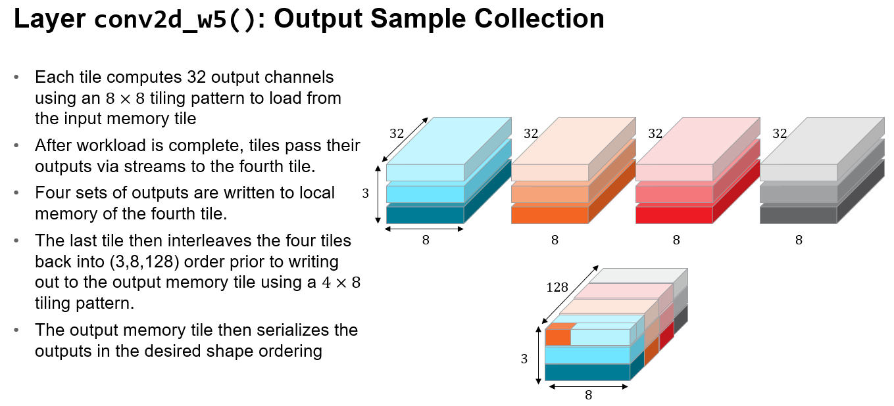

### Layer Design Details: `dense_w7()`

The figure below summarizes the key aspects of the design of the `dense_w7()` layer. The Jupyter Notebook used for validation is [gen_vectors.ipynb](aie/dense_w7/gen_vectors.ipynb). This tile includes three functions, the `flatten_w6()` layer, the `dense_w7()` layer, and the final `softmax()` computation. The layer uses the `mac_elem_16_2()` intrinsic to compute outputs two at a time. Each intrinsic consumes 32 input channels. The `softmax()` activation function is computed using the approach outlined in the [Softmax Function Vitis Tutorial](../05-Softmax-Function/)


## Summary

This tutorial has presented the design of an MNIST ConvNet classifier in AIE-ML. The solution has ~100,000 parameters and requires ~18 tiles. It achieves a throughput of ~70K frames per second. The design illustrates many aspects of building "White-Box" designs for Machine Learning networks using the "dataflow" mode of Vitis AI Engine tool flows developed for signal processing. The similarity of code structure for the various layers of this simple design suggest a library of Machine Learning layers should be feasible in practice. 


## References

[1]: <https://en/wikipedia.org/wiki/MNIST_database> "MNIST database"

[[1]] Wikipedia, "[MNIST database](https://en/wikipedia.org/wiki/MNIST_database)"


## Support

GitHub issues will be used for tracking requests and bugs. For questions, go to [support.xilinx.com](http://support.xilinx.com/).

## License

Components: xilinx-images

images in the documentation

Components: xilinx-files

The MIT License (MIT)

Copyright (c) 2024 Advanced Micro Devices, Inc.

Permission is hereby granted, free of charge, to any person obtaining a copy
of this software and associated documentation files (the "Software"), to deal
in the Software without restriction, including without limitation the rights
to use, copy, modify, merge, publish, distribute, sublicense, and/or sell
copies of the Software, and to permit persons to whom the Software is
furnished to do so, subject to the following conditions:

The above copyright notice and this permission notice shall be included in all
copies or substantial portions of the Software.

THE SOFTWARE IS PROVIDED "AS IS", WITHOUT WARRANTY OF ANY KIND, EXPRESS OR
IMPLIED, INCLUDING BUT NOT LIMITED TO THE WARRANTIES OF MERCHANTABILITY,
FITNESS FOR A PARTICULAR PURPOSE AND NONINFRINGEMENT. IN NO EVENT SHALL THE
AUTHORS OR COPYRIGHT HOLDERS BE LIABLE FOR ANY CLAIM, DAMAGES OR OTHER
LIABILITY, WHETHER IN AN ACTION OF CONTRACT, TORT OR OTHERWISE, ARISING FROM,
OUT OF OR IN CONNECTION WITH THE SOFTWARE OR THE USE OR OTHER DEALINGS IN THE
SOFTWARE.

<p class="sphinxhide" align="center"><sub>Copyright © 2020–2024 Advanced Micro Devices, Inc</sub></p>
<p class="sphinxhide" align="center"><sup><a href="https://www.amd.com/en/corporate/copyright">Terms and Conditions</a></sup></p>

