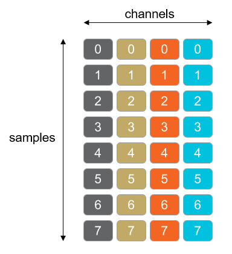
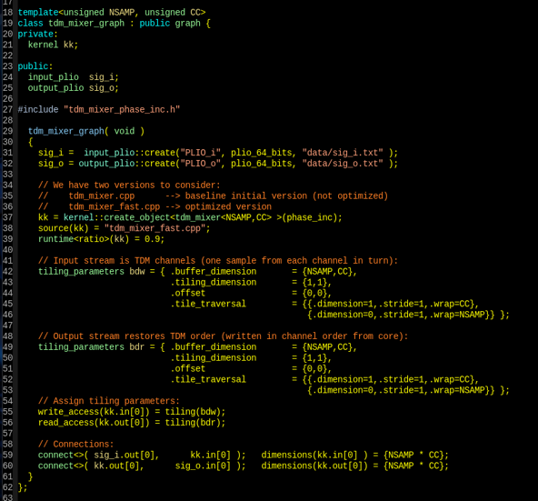
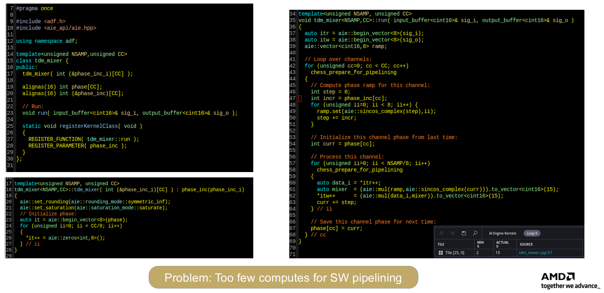
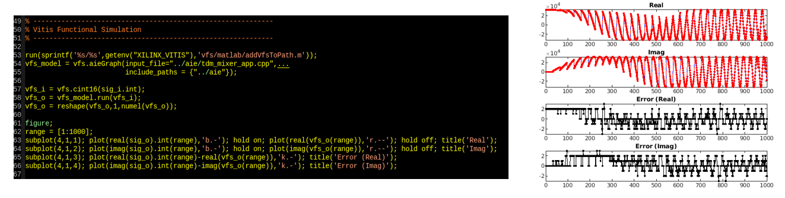
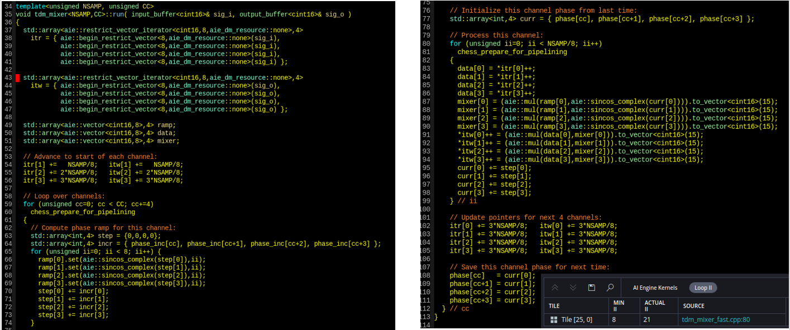
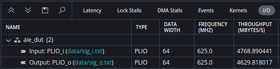

<!--
Copyright (C) 2024, Advanced Micro Devices, Inc. All rights reserved.
SPDX-License-Identifier: MIT
Author: Mark Rollins
-->
<table class="sphinxhide" width="100%">
 <tr width="100%">
    <td align="center"><h1>AI Engine Development</h1>
    <a href="https://www.xilinx.com/products/design-tools/vitis.html">See Vitis™ Development Environment on xilinx.com </a>
    <a href="https://www.xilinx.com/products/design-tools/vitis/vitis-ai.html">See Vitis™ AI Development Environment on xilinx.com</a>
    </td>
 </tr>
</table>

# Time-Division Multiplexed Mixer Example

***Version: Vitis 2024.2***

## Table of Contents

1. [Introduction](#introduction)
1. [Corner-Turning using Tile DMA](#corner-turning-using-tile-DMA)
1. [Baseline Mixer Design](#baseline-mixer-design)
1. [Vitis Functional Simulation](#vitis-functional-simulation)
1. [Optimized Mixer Design](#optimized-mixer-design)
1. [Conclusions](#conclusions)

## Introduction

This tutorial implements a time-division multiplexed (TDM) Mixer design on AI Engine. Wireless designs can employ a TDM strategy when the sampling rate of each channel is much lower than the AI Engine clock rate. For example, in the case where the sampling rate of each channel is 122.88 Msps and the clock rate is 1250 MHz, you might interleave eight channels together into a single-stream input to the AI Engine. This would be a TDM factor of 8. Interleaving of single samples (one from each channel) is preferred over interleaving blocks of contiguous samples from each channel as this minimizes overall latency.

This tutorial targets three goals using the context of the TDM Mixer:
* Illustrate how a "corner-turning" operation can be performed using the DMA hardware resources inside the AI Engine local tile. This approach offloads this "sample reordering" from the AI Engine core processing, instead incorporating it as part of the data flow. This improves overall design efficiency, leaving more core capacity for compute workloads.
* Show how the non-linear `sincos()` generator in each AI Engine tile can be used to vectorize workloads involving phase or frequency generation without the use of lookup tables. 
* Provide another example of how AI Engine code can be optimized for improved software pipelining to achieve higher throughputs through simple code refactoring.

Finally, the tutorial also uses the new Vitis Functional Simulation to run functional simulations of AI Engine designs in the Matlab context. This new flow allows the designer to feed I/O's from Matlab directly to and from the AI Engine for x86 functional simulation without the use of I/O files. This direct connection of the x86simulator to your system model context in Matlab facilitates the verification of your algorithm vectorization as you migrate your algorithms to AI Engine.

## Corner-Turning using Tile DMA

The TDM Mixer accepts I/O's in an interleaved fashion passing one sample from each channel in turn, applying this pattern repeatedly for subsequent samples. Applying a mixer function directly to this TDM stream requires a different frequency to be generated on each sample (assuming each channel operates with its own unique carrier). Vectorization across 8 samples in this case, assuming `cint16` data types, suggests the AI Engine must generate eight unique frequency samples per cycle. However, the non-linear `sincos()` generator in AI Engine is associated with the scalar processor and only capable of producing a single sample per cycle. Vectorization would then require some other approach based on parallel lookup tables or perhaps more costly Taylor series expansions. 

### Vectorization of the Mixer
Consider instead the situation of a single channel mixer. Because this involves only a single carrier, frequency generation can be vectorized across consecutive time-domain samples using the following approach. Assume a carrier angular frequency of $\omega_o$. The `sincos()` generator can be used once per cycle to generate the term $\exp(j\omega(8T_s))$. Here, the `sincos()` generator is advanced by 8 samples to match the desired vectorization; $T_s$ represents the sampling period. A fixed vector phase ramp can be pre-computed with elements $[1, \exp(j\omega T_s), \exp(j\omega 2T_s), \ldots, \exp(j\omega 7T_s)]$. The next 8 samples of the single channel mixer can be computed in vectorized fashion simply via a lane-by-lane multiplication of this vector phase ramp and the scalar exponential produced by the `sincos()` generator. This can be repeated in a sustained loop on a cycle-by-cycle basis since the phase ramp is a fixed vector and the `sincos()` generator can operate on a new input on every cycle. 

### Corner-Turning Concept
You cannot apply this "single channel mixer" directly in the context of the TDM mixer. Samples arrive from different channels in an interleaved manner, yet they arrive consecutively in the single channel case. You have a data flow problem: you must convert your interleaved stream into a channel-by-channel stream at the mixer input and then restore its interleaved format at the mixer output. This operation is sometimes called a "corner-turn" or "2D transpose" operation based on the figure shown below. Samples arrive row-wise interleaved by channel, one sample at a time. The diagram shows four channels and eight samples for each channel. The "single channel mixer" should then be fed with samples chosen column-wise, first 8 samples from channel 0, then eight samples from channel 1, and so on. The minimum # of samples must be eight to match the vectorization. In practice, the column depth will be some multiple of eight.

### Local Tile DMA Tiling Parameters

This corner-turning data flow can be implemented directly by the local DMA hardware in each AI Engine tile. Essentially, the input stream DMA can be programmed directly as outlined above to write the local input buffer "row-wise" using something referred to as a "tiling parameter" shown below. The AI Engine can then read this input buffer "column-wise" when performing its compute operation channel-by-channel, storing its results "column-wise" in its output buffer. Finally, the output stream DMA may be programmed to read the output buffer "row-wise" to restore the TDM nature to the output data stream. The corner-turning performed at both input & output buffers of the mixer takes no compute resources from the AI Engine core since the addressing is computed by the local tile DMA hardware; essentially it becomes part of the data flow.

### TDM Mixer Graph Design

The graph code for the TDM mixer is shown below. The goal is to produce a TDM mixer that runs at full speed > 1000 Msps.

Notice the design is templated to support `NSAMP` I/O samples and to support a total of `CC` channels. `NSAMP` must be a multiple of 8 to match the vectorization. `CC` must be a multiple of 4 to match the assumptions of the final optimized code outlined below. 

The graph encapsulates a single AI Engine tile implementing the mixer kernel. The design supplies I/O data over a single PLIO stream. The design uses I/O buffers of size `NSAMP * CC` samples with default double buffering. For simplicity in this example, the mixer frequencies are configured statically via the `tdm_mixer_phase_inc.h` included header file. 

Notice the two programming model elements used at the graph level to incorporate the corner-turning operations required by the data flow. There are two `tiling_parameters` data structures. The `bdw` instance configures the corner-turning for the input buffer. The `bwr` instance configures the corner-turning for the output buffer. These tiling parameters become associated with particular buffers by annotating the associated kernel I/O ports. Notice how kernel input port `kk.in[0]` becomes annotated with the `bdw` tiling parameter through Line 55: this specifies the `write_access` of this port will be governed by `tiling(bdw)`. Similarly in Line 56: the `read_access` of kernel output port `kk.out[0]` will be governed by the `bdr` tiling parameter through `tiling(bdr)`. 

### Input Buffer Tiling Parameters

The `bdw` tiling parameter governs how input samples are written into the kernel input buffer by the stream DMA. 

Firstly, the `buffer_dimension` is defined. Both 1D and 2D buffers are supported. To effect a corner-turn, you must define a 2D buffer with dimension-0 defined as `NSAMP` samples and dimension-1 as `CC` samples. This defines the physical extent of the buffer. 

The tiling descriptor operates using a concept of "tiles" which can be of dimension $M\times N$ samples. For a simple corner-turn, use a single sample tile with `tiling_dimension` of `{1,1}`, with each tile containing a single sample. 

The DMA hardware will write these "tiles" into the buffer in an order prescribed by the `tile_traversal` that specifies three quantities for each `buffer_dimension`. The first quantity is the next `dimension` to process, the second quantity is the `stride` to take (measured in samples) before writing the next "tile", and the third quantity instructs the DMA engine to `wrap` its address back to zero when it reaches this many "tiles". The `offset` parameter can be used to introduce a starting offset (in each buffer dimension) for the DMA addressing. This feature is not required for corner-turning.

The `bdw` tiling parameter in Line 42 prescribes the following data flow (see [[2]] for additional details):
* The input buffer will be 2D with dimensions `{NSAMP,CC}` with zero offsets in each dimension.
* The DMA will operate on tiles with a single sample.
* The DMA will write into dimension-1 first (along the rows) advancing one sample/tile at a time, wrapping around to zero after `CC` samples.
* The DMA will then advance one sample/tile along dimension-0, and then continue processing along dimension-1 for the remainder of that row.
* The DMA will wrap around to zero in dimension-0 after `NSAMP` samples. 

Clearly, this tiling parameter causes the DMA to write samples by rows (dimension-1) into the buffer. To effect the desired corner-turn, the AI Engine kernel must then read samples by columns (dimension-0) from the buffer. Because no read access tiling parameter is specified by the input buffer, it defaults to a 1D buffer of size `NSAMP*CC` and will read along dimension-0 which is exactly what is needed.

### Output Buffer Tiling Parameters

The `bdr` tiling parameter governs how output samples are read from the kernel output buffer by the stream DMA. This operates in a manner identical to the 'bdw' tiling parameter outlined above except the roles of writing and reading are swapped. Note the AI Engine tile will also write output samples along dimension-0 of a default 1D buffer as no write access tiling parameter is specified. So the kernel writes by columns and the output DMA needs to be read by rows. 

## Baseline Mixer Design

The baseline TDM mixer design implements a single kernel using the vectorization outlined above. It processes `NSAMP` samples of a single channel, then switches to a different carrier frequency and processes `NSAMP` samples of this next channel, and repeats this until all channels have been processed. The input and output buffers can be read in linear addressing order because the DMA has already been configured to place the samples in their proper destinations. 

A summary of this baseline design is shown in the figure below. The design supports `NSAMP=64` samples and `CC=32` channels. The design uses a single compute tile. Buffers are distributed in three tiles. No attempt was made to optimize the design floor plan. The design uses double buffered input and output and contains a single `phase_inc` lookup table that specifies the phase increment for each supported channel. The design was driven by unity values so that each channel produces its own tone.

Notice the compiler has scheduled the inner for loop (Line 57) to achieve an initiation interval (II) of 15 cycles, although the minimum II based on unscheduled hardware operations is only II=2. This indicates that the existing code is quite inefficient and is running about 7X to 8X slower than theory due to poor software scheduling. The code will be refactored below to make improvements. Based on the existing II=15, the design achieves a throughput of ~2600 MB/s or ~550 Msps (with each `cint16` sample taking 4 bytes).

Note a couple of points regarding the II reporting of (Line 57). Firstly, this information will only be displayed by the tool if the "verbose" option is enabled for the compiler. Secondly, the code here contains three for-loops but reporting is only provided for the innermost loop. This may be unexpected, but it means the compiler has elected to apply software pipelining optimization only on this inner most loop for this design. In other designs, the II for multiple loops may be reported if they undergo such pipeline optimization.

The figure below provides kernel code for the baseline design. 

The top left shows the header file code. The static configuration for the mixer frequencies is provided to the constructor from the `phase_inc_i` array. An additional `phase` array holds the state of the mixer between kernel invocations. 

The bottom left shows the constructor code. The initial phase of the mixer channels is initialized to zero in this code. 

The right shows the actual kernel code. The output loop (Line 42) runs over all channels supported by the mixer. Lines 45 to 51 compute the fixed vector ramp required by the current channel. The previous phase value for the current channel is restored from memory in Line 54. The inner loop on Line 57 processes all `NSAMP` samples for the current channel eight at a time using two pipelined operations. The first multiplies the vector ramp by the next value generated by the `sincos()` generator. The second multiplies the 8-lane vector of the mixer phasor with the 8-lane vector of input samples. The `curr` variable accumulates the phase for the `sincose()` generator. Finally, the last phase value is stored to memory in Line 67 for the next kernel invocation.

Note the computation in Line 61-62 involves two 8-lane vector multiplications. These are pipelined instructions that take many cycles to complete. Because the compiler must wait for these instructions to complete before scheduling the next loop body iteration, the loop throughput becomes reduced (or effectively stalled) by the length of these pipelined instructions. For this reason, only an II=15 is achieved when the instructions themselves have an II=2. The key to improving this situation, as will be illustrated below, lies in filling this inner loop with more compute workloads.

## Vitis Functional Simulation

This tutorial uses a new tool feature called Vitis Functional Simulation (VFS) to validate the TDM Mixer implementation in AI Engine against its MATLAB behavioral models. The VFS feature automatically creates "shared objects" of your AI Engine and PL HLS-based kernels in your Versal design, allowing it to be brought into familiar system-level simulation frameworks, namely MATLAB and Python. This allows functional verification of your Versal AI Engine and PL designs without leaving your preferred simulation framework and without creating I/O files for this purpose.

VFS is an EA tool feature in 2024.2. To obtain instructions and design examples, request access to the [Vitis Functional Simulation Early Access Secure Site](https://account.amd.com/en/member/vitis-functional-simulation.html).

The Matlab version of VFS is used to validate the TDM Mixer functional performance. The diagram below shows the MATLAB m-code required to use VFS:
* Include some functional definitions by updating your MATLAB path in Line 53.
* Create an instance of your AI Engine graph using `vfs.aieGraph` in Line 54. 
* Run your model from within MATLAB using the `run()` member function of your VFS instance in Line 58.

## Optimized Mixer Design

The baseline TDM Mixer design outlined above is implemented in the `tdm_mixer.cpp` file. In this section, that file is replaced with `tdm_mixer_fast.cpp` and Line 38 of `tdm_mixer_graph.h` is edited to point its kernel definition to this modified source. The goal here is to address the poor throughput achieved by the baseline implementation due to its poor software pipelining. 

As noted earlier, the baseline version suffers poor throughput because only a single compute workload is initiated per inner loop body, and these vectorized `mac()` instructions are heavily pipelined. You can give the compiler more opportunity to schedule parallel transactions in its instruction slots if you load more compute workloads in each loop iteration. The code below does this by refactoring the solution such that the inner loop performs four compute workloads instead of one. Each workload corresponds to a different mixer channel. In effect, you take four iterations of the outer `CC` loop and push them down into the inner `NSAMP` loop.

One challenge with this approach is that you must bring four input sample sets into this inner loop, rather than just the original one input set. For this reason, there is an array of four read iterators defined in Line 37 and similarly an array of four write iterations in Line 43. Each iterator needs to advance through the I/O buffers by column. One inner loop iteration will advance consecutively through all samples in a single column, but will then need to advance by three columns between inner loop iterations.

You must also pre-compute four fixed-phase ramp vectors instead of one prior to the inner loop. You must keep track of four phase counters instead of one. You must also restore and save four phase states instead of one. 

Given this simple refactoring, you can see that the compiler scheduling analysis has changed. The min II = 8 and the actual II = 21. This seems worse than before (min II=2 and actual II=15), but remember the baseline inner loop processed eight samples for a single channel whereas the optimized inner loop now processes eight samples for four channels. So if you "scale" the baseline values up by 4X, you will see that the minimum II is identical and you are now achieving II=21 vs. an equivalent II=60 in the baseline code. This is a 3X improvement in cycles!

The throughput of the optimized design is ~4600 MB/s or ~1150 Msps as shown below. The design now meets its original throughput target of > 1000 Msps. 

## Conclusions

This tutorial has presented the design of a TDM Mixer on AI Engine. The design uses tiling descriptors in the DMA hardware of the local tile to effect a "corner-turning" data flow without any impact to the core computing resources in the tile. This can be advantageous in many different applications employing multi-channel signal processing. The tutorial also illustrates ~2X throughput improvement from more efficient software pipelining by the compiler via simple code refactoring. Finally, we illustrate how Vitis Functional Simulation can be used to integrate the functional AI Engine x86 simulation models directly into MATLAB for algorithm validation without requiring generation of I/O files or leaving the MATLAB environment. 

## References

[1]:<https://docs.amd.com/r/en-US/am009-versal-ai-engine/Arithmetic-Logic-Unit-Scalar-Functions-and-Data-Type-Conversions> "AIE ALU Scalar Functions"
[[1]]: Versal Adaptive SoC AI Engine Architecture Manual (AM009).

[2]:<https://docs.amd.com/r/en-US/ug1603-ai-engine-ml-kernel-graph/Tiling-Parameters-and-Buffer-Descriptors> "Tiling Parameters and Buffer Descriptors"
[[2]]: AI Engine-ML Kernel and Graph Programming Guide (UG1603).

## Support

GitHub issues will be used for tracking requests and bugs. For questions, go to [support.xilinx.com](http://support.xilinx.com/).

## License

Components: xilinx-images

images in the documentation

Components: xilinx-files

The MIT License (MIT)

Copyright (c) 2024 Advanced Micro Devices, Inc.

Permission is hereby granted, free of charge, to any person obtaining a copy
of this software and associated documentation files (the "Software"), to deal
in the Software without restriction, including without limitation the rights
to use, copy, modify, merge, publish, distribute, sublicense, and/or sell
copies of the Software, and to permit persons to whom the Software is
furnished to do so, subject to the following conditions:

The above copyright notice and this permission notice shall be included in all
copies or substantial portions of the Software.

THE SOFTWARE IS PROVIDED "AS IS", WITHOUT WARRANTY OF ANY KIND, EXPRESS OR
IMPLIED, INCLUDING BUT NOT LIMITED TO THE WARRANTIES OF MERCHANTABILITY,
FITNESS FOR A PARTICULAR PURPOSE AND NONINFRINGEMENT. IN NO EVENT SHALL THE
AUTHORS OR COPYRIGHT HOLDERS BE LIABLE FOR ANY CLAIM, DAMAGES OR OTHER
LIABILITY, WHETHER IN AN ACTION OF CONTRACT, TORT OR OTHERWISE, ARISING FROM,
OUT OF OR IN CONNECTION WITH THE SOFTWARE OR THE USE OR OTHER DEALINGS IN THE
SOFTWARE.

  &copy; Copyright 2024 Advanced Micro Devices, Inc.

