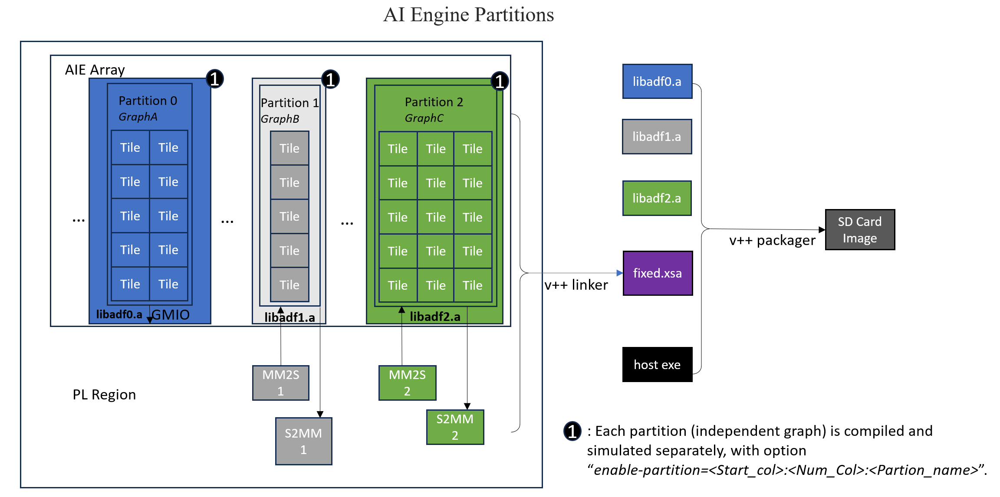

<table class="sphinxhide" width="100%">
 <tr width="100%">
    <td align="center"><h1>AI Engine Development</h1>
    <a href="https://www.xilinx.com/products/design-tools/vitis.html">See Vitis™ Development Environment on xilinx.com</br></a>
    <a href="https://www.xilinx.com/products/design-tools/vitis/vitis-ai.html">See Vitis™ AI Development Environment on xilinx.com</a>
    </td>
 </tr>
</table>

# Compiling AI Engine Graphs for Independent Partitions

***Version: Vitis 2024.2***

## Introduction

This tutorial is designed to demonstrate the flow for compiling AI Engine Graphs for AI Engine partitions. The AI Engine graphs are located in different partitions of the device, verified by aiesimulator independently, but integrated by v++ linker and packager into device. The flow is suitable for multiple teams working simultaneously in different parts of a system project or integrating user owned design with vendor (for example, AMD) provided IPs.

>**IMPORTANT**: Before beginning the tutorial make sure you have installed the AMD Vitis™ 2024.2 software. The Vitis release includes all the embedded base platforms including the VCK190 base platform that is used in this tutorial. In addition, ensure that you have downloaded the Common Images for Embedded Vitis Platforms from [this link](https://www.xilinx.com/support/download/index.html/content/xilinx/en/downloadNav/embedded-platforms.html).

The ‘common image’ package contains a prebuilt Linux kernel and root file system that can be used with the AMD Versal™ board for embedded design development using Vitis tools.

Before starting this tutorial, run the following steps:

1. Go to the directory where you have unzipped the Versal Common Image package.
2. In a Bash shell, run the ``/Common Images Dir/xilinx-versal-common-v2024.2/environment-setup-cortexa72-cortexa53-xilinx-linux`` script. This script sets up the SDKTARGETSYSROOT and CXX variables. If the script is not present, you must run the ``/Common Images Dir/xilinx-versal-common-v2024.2/sdk.sh``.
3. Set up your ROOTFS and IMAGE to point to the `rootfs.ext4` and Image files located in the ``/Common Images Dir/xilinx-versal-common-v2024.2`` directory.
4. Set up your PLATFORM_REPO_PATHS environment variable to ``$XILINX_VITIS/base_platforms``.

This tutorial targets the VCK190 production board for the 2024.2 version.

## Overview

The AI Engine supports column-based partitions. This is enabled by creating independent graphs that can be compiled and simulated separately. Each graph is mapped to a specific column or a contiguous set of columns on the AI Engine array. During the v++ link stage, multiple partitions can be integrated together, provided there is no overlap in the resource usage by the graphs in those partitions.

Following is a conceptual illustration (not exactly the same design in the tutorial) of the AI Engine partions (independent graphs) flow:



Please refer to [UG1076: Compiling-AI-Engine-Graph-for-Independent-Partitions](https://docs.amd.com/r/en-US/ug1076-ai-engine-environment/Compiling-AI-Engine-Graph-for-Independent-Partitions) for an overview of the concepts and configurations for AI Engine partition flow. 

This tutorial contains three AI Engine partitions, which are located in folders `pr0_gmio`, `pr1_rtp` and `pr2_perf`. PL kernels are in folder `pl_kernels`. The host code to control multiple partitions is in folder `sw`.

## Steps 1: Compile and verify each partition with aiesimulator


### Partition `pr0` in folder `pr0_gmio`

Change directory to `pr0_gmio`. Look at aie.cfg:

```
[aie]
enable-partition=6:1:pr0 
```

It defines the partition named  `pr0`. The partition starts from column `6` and totally `1` column.

When compiling AI Engine graph with above configuration file, it constrains all the resources to be within the constrained columns.

To compile the graph, run following command:

```
make aie
```

To simulator the graph, run following command:

```
make aiesim
```

### Partition `pr1` in folder `pr1_rtp` and partition `pr2` in folder `pr2_perf`

Similarly as previous section, the `aie.cfg` in these folders contain the partition configuration. And `make aie` and `make aiesim` can be used to compile and simulate the designs.

## Step 2: V++ linker to integrate the partitions

V++ linker can link multiple independent compilation results together. Look at the `Makefile`. It contains the v++ linker command:

```
LIBADF   = pr0_gmio/libadf.a pr1_rtp/libadf.a pr2_perf/libadf.a
...
xsa: guard-PLATFORM_REPO_PATHS ${XSA}
${XSA}: ${LIBADF} ${VPP_SPEC} ${XOS}
	${VCC} -g -l --platform ${PLATFORM} ${XOS} ${LIBADF} -t ${TARGET} ${VPP_FLAGS} -o $@
```

Notice that the difference with single partition flow is that there are multiple `libadf.a` are used for `v++ -l` command. 

Look at the system configuration file `system.cfg`. The graph ports in the graphs are prefixed with the partition name, for example, the PLIO port `Dataout0` is named as `pr1_Dataout0` in the configuration file:

```
[connectivity]
stream_connect=ai_engine_0.pr1_Dataout0:s2mm_1.s
stream_connect=datagen.out:ai_engine_0.pr1_Datain0
```

Run following command to link the design:

```
make xsa
```

## Step3: Compile host code

In this tutorial, it provides seperate host application to control different partitions. For example, host code in `pr0_gmio/sw` can be used to test partition `pr0` only in hardware. But it also provides host code in `sw` that controls multiple partitions in a single application. The graph name used in the PS host code for XRT API is prefixed with the partition name, for example:

```
auto ghdl=xrt::graph(device,uuid,"pr0_gr");//partition name = "pr0", graph name = "gr"
```

To compile host code for partitions:

```
make host
```

## Step4: Package for hardware

To package the partitions for hardware, run following command:

```
make package
```

Note that multiple `libadf.a` are provide for the packager command, and multiple host applications are packaged into the sd card.

## Step5: Run applications in HW

Boot with sd_card.img and change the working directory to `/run/media/mmcblk0p1`. Run applications to control seperate partitions:

```
./host0.exe a.xclbin
./host1.exe a.xclbin
./host2.exe a.xclbin
```

The graphs are not supposed to be started second time for non-DFX platform. So, you may reboot the system and run following command to test multiple partitons in a single application:

```
./host_all.exe a.xclbin
```

## Summary

After completing this tutorial, you learned:

* Specify compiler configurations for AI Engine partitions.
* V++ linker and v++ packager commands for combining AI Engine partitions.
* Host code to control different partitions in hardware.

### Support

GitHub issues will be used for tracking requests and bugs. For questions go to [forums](http://forums.xilinx.com/).

<p class="sphinxhide" align="center"><sub>Copyright © 2022–2024 Advanced Micro Devices, Inc</sub></p>

<p class="sphinxhide" align="center"><sup><a href="https://www.amd.com/en/corporate/copyright">Terms and Conditions</a></sup></p>

