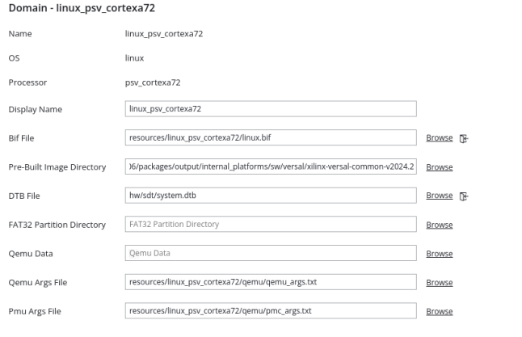
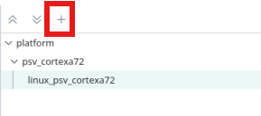
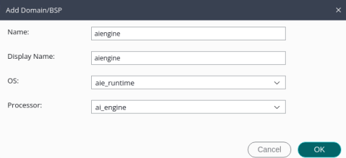

<table class="sphinxhide" width="100%">
 <tr width="100%">
    <td align="center"><h1>Vitis™ Platform Creation Tutorials</h1>
    <a href="https://www.xilinx.com/products/design-tools/vitis.html">See Vitis™ Development Environment on xilinx.com</br></a>
    </td>
 </tr>
</table>

# Step 2: Create the Vitis Software Platform

In this step, you will create a Vitis platform running the Linux operating system. The Vitis platform relies on several software components that must be prepared beforehand. To simplify this process, AMD provides common software images for rapid evaluation, streamlining your development workflow.

It’s important to note that the common image package does not include a Device Tree Blob (DTB) file, as DTB files vary across platforms due to differences in device peripherals. To address this, the platform creation process includes an option to automatically generate a DTB. However, customization might be required depending on the unique demands of your project. If you find the need to fine-tune aspects like the kernel or root filesystem (rootfs), you can refer to [PetaLinux customization page](../../Feature_Tutorials/02_petalinux_customization/README.md) for customization. 
Listed below are the software components necessary for this platform:

| Component                                     | Conventional Path or Filename | Description                                                      | Provenance                         |
| --------------------------------------------- | ----------------------------- | ---------------------------------------------------------------- | ---------------------------------- |
| Boot components in BOOT.BIN                   | bl31.elf                      | Arm® trusted firmware/ secure monitor                            | Extracted from common image        |
| Boot components in BOOT.BIN                   | u-boot.elf                    | Second stage boot loader                                         | Extracted from common image        |
| Boot components in BOOT.BIN                   | system.dtb                    | Device tree information file                                     | Generated with platform creation |
| Boot components in FAT32 partition of SD card | boot.scr                      | U-boot configuration file to store in FAT32 partition of SD card | Extracted from common image        |
| Linux Software Components                     | Image                         | Linux kernel  Image                                              | Extracted from common image        |
| Linux Software Components                     | rootfs.ext4                   | Linux file system                                                | Extracted from common image        |
| Linux SDK                                     | sysroot                       | Cross compile and header files                                   | Extracted from common image        |
> Note: The Kernel Image, Linux file system, and Sysroot are not mandatory components for the platform itself. Instead, they are used to compile the application and generate the SD Card Image.

As most of the components are extracted from the common image package, we will prepare the common image first.

## Prepare the Common Images

1. Download common image from [AMD website download page.](https://www.xilinx.com/support/download/index.html/content/xilinx/en/downloadNav/embedded-platforms.html). 
2. Navigate to the **WorkSpace** folder that you created in step1 and place the image package in **WorkSpace** folder.

   ```bash
   cd WorkSpace
   tree -L 1     # to see the directory hierarchy
   .
   ├── custom_hardware_platform
   └── xilinx-versal-common-v2024.2.tar.gz
   ```

2. Extract the common image.

   Please follow steps below to extract the common image.

   ```bash
   cd WrokSpace
   tar xvf ../xilinx-versal-common-v2024.2.tar.gz -C .
   ```

   You can see the **xilinx-versal-common-v2024.2** folder which contains some components located in **WorkSpace** folder as shown below.

   ```bash
   tree -L 2
   .
   ├── xilinx-versal-common-v2024.2
   │   ├── bl31.elf
   │   ├── boot.scr
   │   ├── Image
   │   ├── README.txt
   │   ├── rootfs.ext4
   │   ├── rootfs.manifest
   │   ├── rootfs.tar.gz
   │   ├── sdk.sh
   │   └── u-boot.elf
   ```

From the above picture, you can see boot file, kernel image, rootfs, and SDK tool are ready. DTB is not available. In the subsequent step, we will focus on preparing the DTB file.


## Create the Vitis Platform

1. Install the sysroot

   - Go to common image extracted directory <WorkSpace/xilinx-versal-common-v2024.2/>.
   - Type `./sdk.sh -d <Install Target Dir>` to install the PetaLinux SDK. Use the `-d` option to provide a full pathname to the output directory. (This is an example. `.` means current directory) and confirm.

   >Note: The environment variable LD_LIBRARY_PATH must not be set when running this command.

   >Note: Sysroot is not mandatory components for the platform itself. It is the cross compile tool 
     
2. Create the Vitis platform.

   For this example, you will use the Vitis Unifeid IDE to create the Vitis Platform. Go to **WorkSpace** directory and follow steps below to create the platform

   - Run Vitis by typing `vitis -w .` in the console. **-w** is to specify the workspace. `.` means the current workspace.
   - In the Vitis IDE, select **File > New Component > Platform** to create a platform component.
   - Enter the **Component name**. For this example, type `custom_platform`, click **Next**.
   - In the XSA selecting page, click **Browse** button, select the XSA file generated by the Vivado. In this case, it is `Your Vivado Project Directory>/custom_hardware_platform_hw.xsa`. 
      >Note: If you want to create a platform with emulation support please click Emulation and select the emulation XSA file. In this case, it is `custom_hardware_platform_hwemu.xsa`.
   - Expand the `Advanced Options` and set the items as following:

   

      - SDT Source Repo: This is used to replace the built-in SDT tool. For this tutorial, leave it empty.
      - Board DTSI: Specify the board machine name, which is used to retrieve the board-level DTSI file. For this tutorial, leave it empty. To check the board machine name, refer to [UG1144 Machine Name Checking](https://docs.amd.com/r/en-US/ug1144-petalinux-tools-reference-guide/Importing-a-Hardware-Configuration)
      - User DTSI: Allows you to specify a custom DTSI file. Click **Browse** and select the the `system-suer.dtsi` file located in the `ref_files/step2_pfm` folder.
      - DT ZOCL: Enables Zocl node generation for the XRT driver. Ensure this option is enabled, then click **Next**.

   - Set the **Operating System** to `Linux` and the **Processor** to `psv_cortexa72`. Enable the `Generate Device Tree Blob (DTB)` option, then click **Next**.
      > Note: Enabling this option allows the tool to automatically generate a DTB file using the provided DTSI and XSA files. The DTB file is located in `<platform component>/hw/sdt/` folder.
   - Review the summary and click **Finish**.

   

   - Click the **linux On psv_cortexa72** domain.
   - Set **Bif file**: Click the button as shown in the following diagram and generate BIF file. The BIF file is generated in the resource directory.
  
      

   - **Pre-Built Image Directory**: Browse to extracted common image path directory: `xilinx-versal-common-v2024.2/` and click OK. Bootgen looks for boot components referred by BIF in this directory to generate `BOOT.BIN`.
   - **DTB file**: DTB will be generated automatically and populated in this area.
   - **FAT32 Partition Directory**: if you have additional file to be stored in FAT32 partition diretory you can browse to the file. If not please omit this.
   - **QEMU Data**: This Directory is used to add additional file for emulation. User can set it according to your requirement.
   - In the flow navigator, click the drop-down button to select the component. In this case, select **vck190_custom** component and click the **Build** button to build the platform.
   - 
   >Note: If there are additional QEMU settings, update `qemu_args.txt` accordingly.

3. Add the AI Engine domain.

     - Click **+** button to add a domain.

         

     - Set Name to **aiengine**.
     - Change OS to **aie_runtime**.
     - Keep other settings to default and click **OK**.

         

4. Select **custom_platform** platform component in the flow navigator, then click the **Build** button to build the platform.

   

   >Note: The generated platform is placed in the `custom_platform` directory. The platform is ready to be used for application development

   

   >Note: Users can locate the XPFM file by expanding the Output directory. This provides a logical view of the output. The actual path of platform file is under `WorkSpace/custom_platform/export/custom_platform/` directory. Users can also view the complete path of the platform file by simply hovering the mouse pointer over the XPFM file.

   >Note: The Vitis Unified IDE will find the boot-related files menntioned in the software components in begin of this step and place them in the boot folder of the platform.

   If you create a Vitis application component in the same workspace as this platform component, you can find this platform available in the platform selection page in the application Creation wizard. If you want to reuse this platform in another workspace, add its path to the PLATFORM_REPO_PATHS environment variable before launching the Vitis GUI, or use the "Add" button on the platform selection page of the Vitis GUI to add its path.

   User could also use Vitis Python command to create the platform component.

   <details>
   <summary><strong>Click here to see how to use Vitis python command to create a Vitis platform.</strong></summary>
   Create a python script. For example, here is the parts of [platform_creation.py](./ref_files/step2_pfm/platform_creation.py).

   ```Tcl
   import vitis
   import argparse
   import os
   print("Platform generation")
   parser = argparse.ArgumentParser()
   parser.add_argument("--platform_name", type=str, dest="platform_name")
   parser.add_argument("--xsa_path", type=str, dest="xsa_path")
   parser.add_argument("--xsa-emu_path", type=str, dest="emuxsa_path")
   parser.add_argument("--boot", type=str, dest="boot")
   parser.add_argument("--user_dtsi", type=str, dest="user_dtsi")
   args = parser.parse_args()
   platform_name=args.platform_name
   xsa_path=args.xsa_path
   emuxsa_path=args.emuxsa_path
   user_dtsi=args.user_dtsi
   boot=args.boot
   print('args',args)
   client = vitis.create_client()
   workspace_path = os.getcwd() + "/ws" 
   client.set_workspace(path=workspace_path)
   print(workspace_path)
   advanced_options = client.create_advanced_options_dict(dt_zocl="1",dt_overlay="0", user_dtsi=user_dtsi)
   platform = client.create_platform_component(name =platform_name ,hw_design = xsa_path,emu_design = emuxsa_path,os = "linux",cpu = "psv_cortexa72",domain_name = "linux_psv_cortexa72",generate_dtb = True,advanced_options = advanced_options)
   platform = client.get_component(name=platform_name)
   domain = platform.add_domain(cpu = "ai_engine",os = "aie_runtime",name = "ai_eingine",display_name = "ai_eingine")
   domain = platform.get_domain(name="linux_psv_cortexa72")
   status = domain.update_name(new_name="xrt")
   status = domain.generate_bif()
   status = domain.set_boot_dir(path=boot)
   status = platform.build()
   ```
   This python script is for user to create a platform. It needs the following input values.

   - `name`: Platform name.
   - `hw`: Hardware XSA file location.
   - `emulation_xsa_path`: Hardware emulation XSA file location.
   - `boot`: pre-built image path.
   - `user_dtsi`: user dtsi file path.

   The following is the command brief explanation.
   - `client.create_platform_component` is used to create a platform with standalone domain or the Linux domain. 
   - `domain.add_boot_dir` is used to set the pre-built image path.  
  

   You can pass the values to the script directly by replacing the variable with the actual value, or pass the value to python script. Here is an example of calling python script.

   ```bash
   vitis -s platform_creation.py --platform_name <> --xsa_path <> --xsa-emu_path <> --boot <> --dtb <>
   ```

   </details>


   Now you have completed the platform creation. Next, we will validate the output of this step.

## Validate the Output of Step 2

   With Vitis environment setup, the **platforminfo** tool can report XPFM platform information.

   You can verify hardware configuration (clocks, memory) and software configuration (domain) are set as expected.

   <details>
   <summary><b>Show Log</b></summary>

   ```bash
   #  go to the  XPFM file directory
   cd WorkSpace/custom_platform/export/custom_platform/
   # Report Platform Info
   platforminfo custom_platform.xpfm
   ==========================
   Basic Platform Information
   ==========================
   Platform:           custom_platform
   File:               /WorkSpace/custom_platform/export/custom_platform/custom_platform.xpfm
   Description:        

   =====================================
   Hardware Platform (Shell) Information
   =====================================
   Vendor:                           xilinx.com
   Board:                            extensible_platform_base
   Name:                             extensible_platform_base
   Version:                          1.0
   Generated Version:                2024.2
   Hardware:                         1
   Software Emulation:               1
   Hardware Emulation:               1
   Hardware Emulation Platform:      0
   FPGA Family:                      versal
   FPGA Device:                      xcvc1902
   Board Vendor:                     
   Board Name:                       
   Board Part:                       

   =================
   Clock Information
   =================
   Default Clock Index: 0
   Clock Index:         0
      Frequency:         156.250000

   ==================
   Memory Information
   ==================
   Bus SP Tag: DDR
   Bus SP Tag: LPDDR

   =============================
   Software Platform Information
   =============================
   Number of Runtimes:            1
   Default System Configuration:  custom_platform
   System Configurations:
   System Config Name:                      custom_platform
   System Config Description:               
   System Config Default Processor Group:   aie
   System Config Default Boot Image:        standard
   System Config Is QEMU Supported:         1
   System Config Processor Groups:
      Processor Group Name:      linux_psu_cortexa72
      Processor Group CPU Type:  psu_cortexa72
      Processor Group OS Name:   xrt
      Processor Group Name:      aie
      Processor Group CPU Type:  ai_engine
      Processor Group OS Name:   aie
   System Config Boot Images:
      Boot Image Name:           standard
      Boot Image Type:           
      Boot Image BIF:            boot/linux.bif
      Boot Image Data:           linux_psu_cortexa72/image
      Boot Image Boot Mode:      
      Boot Image RootFileSystem: 
      Boot Image Mount Path:     
      Boot Image Read Me:        
      Boot Image QEMU Args:      qemu/pmc_args.txt:qemu/qemu_args.txt
      Boot Image QEMU Boot:      
      Boot Image QEMU Dev Tree:  
      Supported Runtimes:
   Runtime: C/C++
   ```

   </details>

## Fast Track

Scripts are provided to create the Vitis platform. To use these scripts, please run the following steps.

1. Run build.
   > **NOTE:** Download the common image from [Xilinx website download page.](https://www.xilinx.com/support/download.html) and give its path to the following command.

   ```
   # cd to the step directory, e.g.
   cd step2_pfm
   make all COMMON_IMAGE_VERSAL=<path/to/common_image/>
   ```

2. To clean the generated files, please run

   ```bash
   make clean
   ```

## Next Step

Next, try to [build some applications on this platform and test them.](./step3.md)


<p class="sphinxhide" align="center"><sub>Copyright © 2020–2024 Advanced Micro Devices, Inc</sub></p>

<p class="sphinxhide" align="center"><sup><a href="https://www.amd.com/en/corporate/copyright">Terms and Conditions</a></sup></p>
